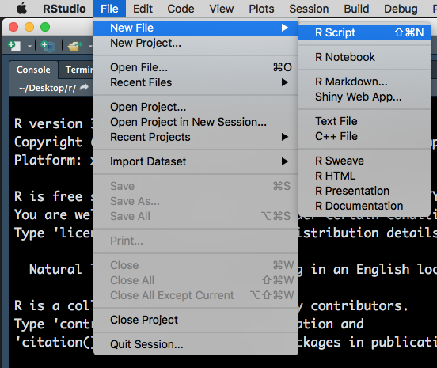
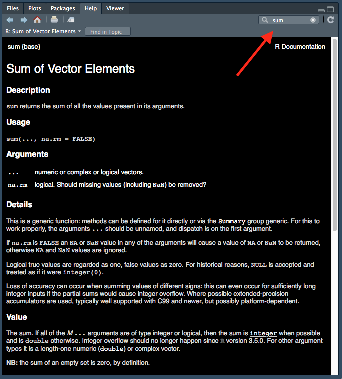
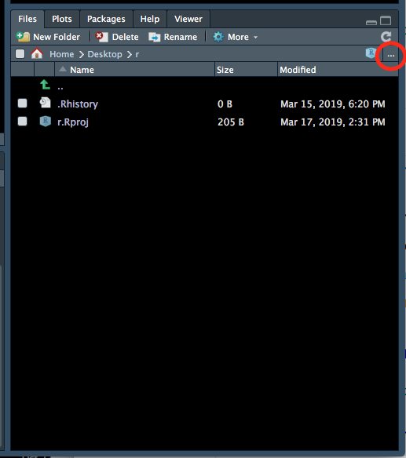
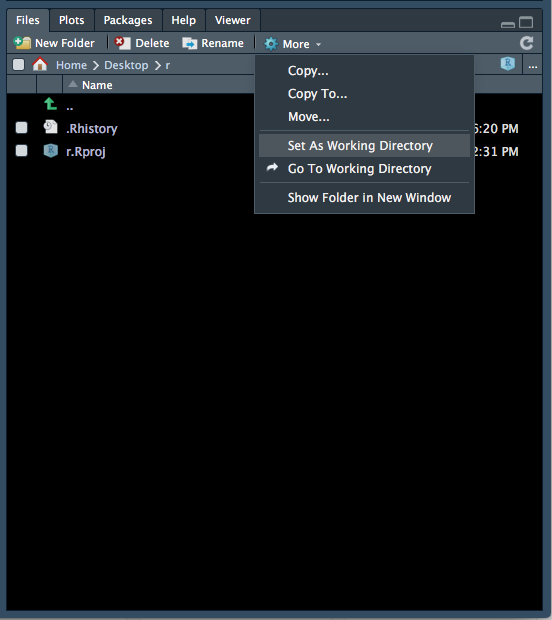
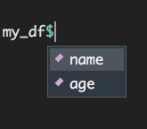

# Session 1

In this first session we will learn about:

* R and RStudio
* data types and data structures
* vectorisation
* how to read in and write out data

## R and RStudio

R is a free and open source statistical programming language, great for performing data analysis. RStudio is a free and open source R integrated development environment (IDE) which makes it easier for you to write code. It does this by providing you with auto-completion (of variable names, function names, file paths etc.), helping with formatting and keeping track of your variables.

You can think of R as the engine in a car and RStudio as the body & controls. R is doing all the calculations/computations but RStudio makes it easier for you to use R.

When you first open RStudio, there will be three panels - see Figure \@ref(fig:RS1) (don't worry if your RStudio does not have the same colours/appearance - different versions of RStudio look slightly different and the text colour I use is not the default one.)

```{r RS1, fig.cap='Three panels in RStudio.', out.width="700px", echo=FALSE}
knitr::include_graphics("Images/RS1.png")
```

* Left panel: this panel features two tabs, 'Console', which is where you can type in commands for R to run and 'Terminal', which we won't worry about in this course.
* Top right panel:
    * Environment - in this tab you can see all variables you have created.
    * History - R keeps track of all commands you have run and you can review them in this tab. 
    * Connections - this tab helps you connect to data sources but we will not be using it in this course.
* Bottom right:
    * Files - you can explore your file directory here and we will use it to set our working directory later.
    * Plots - plots that you create will either appear here or be saved to a file.
    * Help - help files for R functions can be viewed in this tab. Help files tell you about what a function does and how to use it.
    * Packages - basic R includes many useful functions. You can add even more functions by downloading packages. A package is a collection of functions, generally with a certain data analysis theme. For example, the package 'limma', which we will use later, includes functions for analysing RNA-sequencing data.
    * Viewer - this tab lets you view local web content but we won't be using it in this course.
    
## R scripts

To open a R script, go to File > New File > R Script.

```{r RS2, fig.cap='Opening a new R Script.', out.width="700px", echo=FALSE}

```

This will open a fourth panel on the top left. 

```{r RS3, fig.cap='Four panels, including a R Script.', out.width="700px", echo=FALSE}
knitr::include_graphics("Images/RS3.png")
```

A R Script is just a text document. You can type and run commands using a R Script and down in the Console - the difference is that you can't save the commands you run in the Console but you can save the R Script with all your commands. Note that to run a command in the Console press `Enter` key but to run a command in a R Script you must press `Cmd/Ctrl + Enter` keys.

Lastly, you can make 'comments' in your R Script. Comments are notes to yourself that are not interpreted by R and start with `#`:

```{r}
# this is a note to myself
1+3-2
```

## Help

There are two ways to access help files in RStudio. You can type in the name of the function you want help with, in the top right of help tab (indicated with a red arrow):

```{r help, fig.cap="Accessing help files via 'help' tab.", out.width="500px", fig.align='center', echo=FALSE}

```

The other option is to run the command `?` followed by the name of the function:

```{r, eval=FALSE}
?sum
```

Help files are very useful but can be difficult to interpret at first due to the technical language used. We won't get too much practice reading help files during this course but I would encourage you to try to use them when figuring out how to use a new function.

## Working directory

Every file on your computer is located in a specific location. This location can be referred to by a path. In Mac, paths look something like this: `/Users/Lucy/Documents/`. In Windows, paths look something like this: `C:\Users\Lucy\Documents\`. 

When you open a R session, it launches from a specific location. You can find out where this is using the command `getwd()`. This location called the 'working directory'. R will, by default, look in this directory when reading in data and write out files/plots to this directory. It is often useful to have your data and R Scripts in the same directory and set this as your working directory.

You can set your working directory to be anywhere you like and we will now do this:

1. Make a folder for this course, somewhere sensible on your computer that you will be able to easily find. 
2. Go back to your RStudio window, go to the bottom right panel, click on the 'Files' tab and then click on the three dots on the top right hand corner (Figure \@ref(fig:wd1)).

```{r wd1, fig.cap='Setting the working directory - 1.', out.width="500px", echo=FALSE, fig.align='center'}

```

3. This will open up a new window (Figure \@ref(fig:wd2)) which lets you explore the files and folders on your computer. Find the new folder you created, click on it then click 'Open'.

```{r wd2, fig.cap='Setting the working directory - 2.', out.width="500px", echo=FALSE, fig.align='center'}
knitr::include_graphics("Images/wd2.png")
```

4. The files tab will now show the contents of your new folder (which should be empty). At the top of the files tab, click on More > Set As Working Directory (Figure \@ref(fig:wd3)).

```{r wd3, fig.cap='Setting the working directory - 3.', out.width="500px", echo=FALSE, fig.align='center'}

```

Please set your working directory to be this folder at the start of EVERY session.

## Maths

R performs maths and follows standard order of operations. In order of highest to lowest precedence, here is how mathematical operations are denoted in R:

* `()` - parentheses
* `**` or `^` - exponents
* `/` - divide
* `*` - multiply
* `+` - add
* `-` - subtract

Another useful function is modulus (`%%`), which gives the remainder after dividing:

```{r}
8%%3
```

## Comparisons {#comps}

You can also compare numbers in R:

```{r}
1 == 1  # equal to.
1 != 1 # not equal to
2 > 1   # greater than.
2 < 1   # less than.
1 <= 2  # greater or equal to.
1 >= 2  # less than or equal to.
```

The `!` sign by itself means "not" and it reverses the logical. For example, "not" TRUE is FALSE.

```{r}
!TRUE
```

You can also compare words. What do you think will happen below?

```{r}
"cat" > "dog"
```

R will use alphabetical order to determine which word is 'greater':

```{r}
"a" < "b"
```

## Variables

A variable in R is just a name which refers to an 'thing' (more technically an 'object' in R).

For example, I can do some maths:

```{r}
2 + 6 * 7**2
```

R outputs the result. However, if I want to 'save' this result to use later, I need to 'assign' the output to a variable. This can be thought of as giving it a name, so that we can refer to it later.

You can this with `<-` (shortcut = `alt + -`) in R. (You can also use `=`, however stylistically `<-` is preferred.)

Here R performs the calculation on the right of `<-` and then saves the result as a variable called `my_num`.

```{r}
my_num <- 2 + 6 * 7**2
```

Now if I run the command `my_num`, I see the number I stored earlier:

```{r}
my_num
```

You can also 'overwrite' variables:

```{r}
my_num <- 3 * 4
```

The above code evaluates `3 * 4` and assigns the output to the variable `my_num` - effectively 'overwritting' the previous value assigned to it.

```{r}
my_num
```

R is particular about variable names. Variable names cannot:

* start with a number 
* contain any spaces

If we try to create a variable that starts with a number, R will return an error:

```{r, error=TRUE}
2myvar <- 2 + 6 * 7**2
```

### Errors and warnings

This is a good time to talk about 'errors' and 'warnings' in R.

An *error* is R telling you that it couldn't do what you told it to do. Do not be disheartened at seeing an error message - it happens to everyone, including experienced programmers, all the time. DO read the error message, it is often very useful and tells you what you need to do to fix the error.

A *warning* is R telling you that is has done what you told it to do, however the result may not be what you want. Sometimes it is okay to ignore a warning, sometimes it is not!

## Data structures

A data structure can be thought of as a 'container' for data. There are a number of different data structures in R and each have different specifications about how data is stored. 

Three commonly used data structures are summarised below:

```{r dstruct, fig.cap='Data structures. Source: http://libguides.wellesley.edu.', out.width="700px", echo=FALSE, fig.align='center'}
knitr::include_graphics("Images/data-structure.png")
```

Another useful data structure is a 'list', which we will talk about in Session 3.

### Vector

You can think of a vector like a row or column in excel. You can only store one *type* of data in a vector - e.g. all numbers or all text.

You can create vectors with the `c()` function ('c' for 'combine'):

```{r}
my_vect1 <- c(1,2,3)
my_vect2 <- c("a", "b", "c")
```

### Matrix

A matrix is like an excel spreadsheet. It is two dimensional meaning you have columns and rows of data. You can only store one *type* of data in a matrix - e.g. all numbers or all text.

### Dataframe

Dataframes are also two dimensional (has both rows and columns) however, you can store different types of data in a dataframe. The only restriction is that all the data within one column must be of the same type.

A dataframe is composed of vectors, with each vector being one column. You can create a dataframe using the `data.frame()` function:

```{r}
my_df <- data.frame(
  cats = c("Hello Kitty", "Garfield"), 
  weight = c(4.5,7)
)
my_df
```

There are a few important things to note:

1. `name` and `age` become the names of the columns.
2. the `,` at the end of `cats = c("Hello Kitty", "Garfield")` is important and should not be missed.
3. each column in a dataframe is essentially a vector. Do not forget the `c()` when inputing the values within each column.

You can access a column in a dataframe with the shortcut `$`. Notice that the names of all columns of the dataframe appears after typing in `my_df$`:

```{r dfdollar, fig.cap="Accessing columns in a dataframe using the '$' symbol.", out.width="350px", echo=FALSE, fig.align='center'}

```

**Challenge 1.1**

Create a dataframe called `my_df2` with 2 columns. The first column named "dogs" should be a vector with the values: "spot", "snoopy". The second column named "weight" should be a vector with the following values: 3.5, 4.8.

Write this dataframe out to a .tsv file named 'Ses1_dogs.tsv'.

## Reading in data

Let's read in some data and start exploring it. 

You should have received the data files via email before the course. Please download these files and make sure they are located in your working directory. Recall, we set our working directory above. You can find the location of your working directory with the function `getwd()`. 

If you are following along outside of the WEHI course, you can download the data files from [Github](https://github.com/lucyleeow/BaseR_Intro/tree/master/data) - instructions for downloading data from GitHub can be found in the Preface.

The file we want to read in is named 'Ses1_genes.tsv'. 

I have put all my data files in a directory called 'data' - thus the path to the file (relative to my working directory) is 'data/Ses1_genes.tsv'. Depending on where you have put your data (in your working directory or in another file in your working directory), the path to your file 'Ses1_genes.tsv' may be different.

Read in your data by typing in the path to your 'Ses1_genes.tsv' file (relative to your working directory), within the brackets `( )`:

```{r}
read.delim("data/Ses1_genes.tsv")
```

Note that `read.delim()` also lets you specify what kind of file you are reading in - by this I mean how each value is separated. Two common formats are 'csv' (comma separated values) and 'tsv' (tab separated values).

Example of csv file:
```
Name, Age
Andy, 10
Bob, 8
```

Example of tsv file:
```
Name  Age
Andy  10
Bob   8
```

Notice in the above two examples the values are separated by different 'characters'.

You can specify what 'character' separates each value by using the `sep` input in `read.delim()`. E.g. if your file was a csv, you can read it in using:

```{r, eval=FALSE}
read.delim("file.csv", sep = ",")
```

We don't need to specify the `sep` for our file, which is a tsv, as the default separator `read.delim()` assumes is tab. Thus we only need to specify when we are reading in a file NOT separated by tabs.

Above, we have read in our data as a dataframe and printed it. However, we can't refer to this dataframe again and manipulate it because we haven't assigned it to a variable.

Let's assign our dataframe to a variable called `genes`:

```{r}
genes <- read.delim("data/Ses1_genes.tsv")
```

Notice how `genes` now appears in our 'Environment' tab:

```{r import, fig.cap="Variable in 'Environment' tab.", out.width="500px", echo=FALSE, fig.align='center'}
knitr::include_graphics("Images/import.png")
```

All variables that we create will be shown in this tab, so it is a useful way to keep track of variables that we have created. Notice how R also tells us that there are 10 observations (rows) and 3 variables (columns) in the `genes` dataframe.

### Summary

A useful function for investigating your data is `summary()`. Running this function on our `genes` dataframe provides us with summary statistics on all the numeric columns. For the columns that don't contain numbers, the output simply states the length of that column.

```{r}
summary(genes)
```

### Structure

A useful function for understanding how our data is stored in R is `str()` (structure). 

```{r}
str(genes)
```

The output tells us that `genes` is a dataframe. It also tells us what *data type* each column is. 

## Data types

Every bit of data in R has a 'data type label'. The label doesn't change the data in any way - it just tells R what kind of data it is and thus what it can and can't do with the data.

For example, it makes sense to perform mathematical functions on numbers but not on words. It makes sense to look for a certain term, like a gene name, in words but not in numbers.

For example, you can't add words so the code belwo doesn't work. Note that quotes (`" "` or `' '`) ALWAYS surround values that are of the 'character' data type:

```{r, error=TRUE}
"one" + "two"
```

This does work because they are numbers:

```{r}
1 + 2
```


There are five basic types of data in R:

* `logical` - either TRUE or FALSE. This is useful for data that only has two possible values, like if patient has a disease or not.
* `integer` - number without decimal point e.g. `3`.
* `double` - number with decimal point e.g. `3.14`.
* `complex` - complex number with a real and imaginary part e.g. `1 + 3i`
* `character` - Anything with character(s) within it. Quotes (double or single) signify this data type e.g. `"pi"`. Also known as a 'string'.

In our `genes` dataframe above, we can see that both the `GeneLength` and `Count` columns are integers ('int'). But what is the `SYMBOL` column? It is a 'Factor'.

### Factors {#factors}

Factor is a data type label used for categorical variables (e.g. small, medium and large OR red, blue and green). Internally, R stores factors as numbers (integers), with each number corresponding to a category.

For example, if your data was:

```
red, blue, green, red, green
```

Internally, R would store the data as:

```
1, 2, 3, 1, 3
```

Each number corresponds to a category. This information is also stored. In R, the categorical values each number corresponds to, is called 'levels'.

The levels for the above data would be:

```
1 = red
2 = blue
3 = green
```

Factors can be difficult to work with, so we don't want our gene symbols to be 'labelled' as factors. We can do this by specifying this when reading our data in:

```{r}
genes <- read.delim("data/Ses1_genes.tsv", stringsAsFactors = FALSE)
```

By default, R will label all word ('character') data as a 'factor'. Setting `stringsAsFactors` to be `FALSE`, tells R that you DON'T want it to do this.

We can check the structure again:

```{r}
str(genes)
```

Notice that now the column `SYMBOL` is now a character ('chr').

Another way to change the labels of data in R is with the following functions:

* `as.logical()`
* `as.integer()`
* `as.double()`
* `as.complex()`
* `as.character()`

For example, this will turn a integer vector into a character vector:

```{r}
as.character(c(1,2,3))
```


### Type coercion

In some circumstances, R will change the data type label of your data. This is called 'type coercion'. A common scenario in which this will happen is with vector (and dataframe column) labelling.

All elements within a vector (and within a column of a dataframe) must have the same data type label. Thus, if you create a vector like the one below, the whole vector will be labelled as one data type. Which data type do you think it will be?

```{r}
my_vect3 <- c(1, 2, "a")
```

We can find out with `str()`:

```{r}
str(my_vect3)
```

It has labelled the whole vector as characters. This is because the letter `"a"` cannot be "expressed" as a number but numbers can be "expressed" as characters - thus R will always pick the data type label that does not result in any loss of information. Recall that data type labels NEVER change the data - only the label changes.

There is an order to which data label R will label a vector as. Of all the data types that exist in the vector, the data type of the element that is furthermost right, will be the "final" data type label for the vector.

`logical` > `integer` > `double` > `complex` > `character`

This order makes sense:

* the logicals `TRUE` and `FALSE` can be represented by numbers with `TRUE` = `1` and `FALSE` = `0`. 
    * when logicals are labelled as the character type, `TRUE` simply becomes `"TRUE"`
* an integer can easily be represented by a double - `3` becomes `3.0`
* as we saw above, numbers can easily be represented as a character 

The last thing to note is that you may see the type `num`:

```{r}
str(c(1,2,3))
```

`num` stands for numeric and is just the 'number' data types grouped together. R does this for two reasons. First, generally you don't need to know exactly what 'type' of number class your data is. Second, R will often convert between number types depending the type of calculations/function performed.

**Challenge 1.3**

1. What data type will the following vectors be?

```{r, eval=FALSE}
# 1
c(TRUE, 3, 4)
# 2 
c("hello", TRUE, 4)
# 3
c(4, "5")
```

2. Create a vector called `my_vect3` that contains the following numbers: 1,1,2,3,5,8. 
    * Convert this vector into the character data type. How can you tell that the values are now characters?
    
## Vectorisation {#vect}

R is quite efficient at doing calculations or performing a functions on a vector of data.

Let's use the `Count` column from our dataframe `genes`. We can access just one column using the `$` symbol:

```{r}
genes$Count
```

What do you think will happen if we do this?

```{r}
genes$Count + 10
```

R will perform this calculation on all numbers in the `Count` column and return a vector.

We can add this new vector to our dataframe, as a new column.

```{r}
genes$Count_2 <- genes$Count + 10
```

There are a few things happening in the above code: 

1. The code on the right side of `<-` is evaluated first. It returns a vector as we saw above.
2. This vector is assigned to a column in `genes` called `Count_2`. Since this column does not yet exist in the `genes` dataframe, a new column called `Count_2` is created first. (If there was already a column name `Count_2`, this command will have overwritten that column with the new vector created in the right side of `<-`)

Note that you could also REPLACE a column using the same notation. For example, if, in the command above, the left side was `genes$Count`, the old column called `Count` would be REPLACED with the new vector of numbers created on the right side.

**Challenge 1.2**

Create a new column called `Prop_Count` that contains each count value as a proportion of the total count value of all 10 genes in the dataframe. E.g. if `Count` was 10 and total count of all 10 genes is 100, that row in `Prop_Count` should be 0.1.

*Hint* use the `sum()` function.


## Writing out data {#write}

The last thing we will do this session is learn to write out data using the function `write.table()`.

There are a few things we must tell `write.table()`, for it to be able to write out the data the way we want:

* `x` - the name of this input is not very informative, but first you must tell the function what you want to write out. In our case we want to write out our dataframe `genes`.
* `file` - the name of the file that we want to write to.
* `sep` - how each value in our output file is separated. Common file formats are 'csv' and 'tsv' (discussed above). In R, a tab is represented by `"\t"`.
* `row.names` - this is either `TRUE` or `FALSE`, and let's you specify whether you want to write out row names. If your dataframe does not have row names, put `FALSE`.
* `col.names` - this is also either `TRUE` or `FALSE`, and let's you specify whether you want to write out column names. If your dataframe has column names, put `TRUE`.

We can write out our `genes` dataframe into a .tsv file using the command below:

```{r, eval=FALSE}
write.table(x = genes, file = "Ses1_Genes_output.tsv", sep = "\t",
            row.names = FALSE, col.names = TRUE)
```

## Homework

Read in the data file "Ses1_homework.tsv" using `read.delim()`. This file is similar to the "Ses1_genes.tsv" file but with a different 10 genes.

Create a new column called `Prop_GeneLength` that contains the `Count` value as a proportion of `GeneLength`. E.g. if the count value was 50 and the gene length was 2400, the `Prop_GeneLength` value for that row would be 0.02083333.

Finally, write out this new dataframe as a file called "Ses1_homework_output.tsv", as a tsv (tab separated values) file.

## Answers

**Challenge 1.1**

```{r}
my_df2 <- data.frame(
  dogs = c("Garfield", "Hello Kitty"),
  weight = c(3.5, 4.8)
)
```


**Challenge 1.2**

1.
```{r}
str(c(TRUE, 3, 4))

str(c("hello", TRUE, 4))

str(c(4, "5"))
```

2.
```{r}
my_vect3 <- c(1,1,2,3,5,8)
# convert to character
my_vect3 <- as.character(my_vect3)
# quotes around each value show that they are of the character type
my_vect3 
```

**Challenge 1.3**

The `sum()` function can be used to calculate the total Count of all 10 rows by giving the `genes$Count` vector as the input to `sum()`.

```{r}
genes$Prop_Count <- genes$Count / sum(genes$Count) 
genes
```


