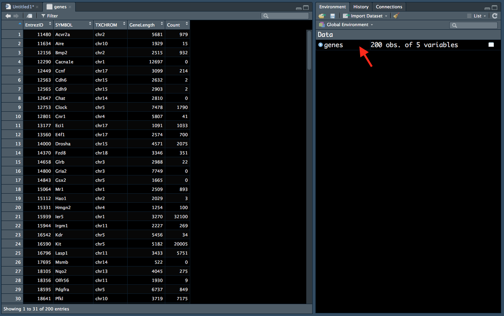

# Session 2

Last session we gained an understanding of R data structures and data types. In this session we will learn about:

* missing values
* subsetting data structures
* how to merge two dataframes
* how functions are created and used

## Missing values

First, let's read in some data, then subset it. Recall we use the function `read.delim()` and tell R not to label words as 'Factors' using `stringsAsFactors = FALSE`.

```{r}
genes <- read.delim("data/Ses2_genes.tsv", stringsAsFactors = FALSE)
```

You can see in the environment tab that this dataframe has 200 rows (observations) and 5 columns (variables). You can also click on the `genes` entry in the Environment tab (red arrow in Figure \@ref(fig:RS4)) to display the data in a new window (left):

```{r RS4, fig.cap="Viewing data from the 'Environment' tab.", out.width="700px", echo=FALSE}

```

Scrolling down the window, you can see that there are several *NA* entries. `NA` denotes a missing value in R.

`NA`'s have some interesting behaviour - the are 'contagious'. For example, if we wanted to take the mean of a vector numbers, which includes a `NA`, the answer is `NA`. If we think about it, it makes sense that the mean of two numbers and a 'missing' number that could be anything is `NA`.

```{r}
mean(c(2,3,NA))
```

Luckily many functions have a `na.rm` input, where you can tell it to remove `NA` values:

```{r}
mean(c(2,3,NA), na.rm = TRUE)
```

Later we will learn how to remove the `NA` values from our dataframe.

## Subsetting

Subsetting involves selecting a portion of a data structure and uses square brackets `[ ]`. There are two main ways to subset a data structure:

* Use indicies - data structures are all ordered and 'numbered' in R. This means that you can refer to the 4th element in a vector or the element in the 1st row and 3rd column of a dataframe. 
* Use logicals - recall that a logical is `TRUE` or `FALSE`. You can use comparisons (e.g. equal to `==`, greater than `>`) to determine if each element in your data structure meet your requirements.

### Subsetting with indicies

Let's take a look at subsetting vectors first. We can use `$` to obtain just one column from the `genes` dataframe. The output will be a vector.

```{r}
genes$Count
```

We will assign this to a variable called `Counts`. `Counts` is now a variable that refers to a vector containing 200 integers.

```{r}
Counts <- genes$Count
```

This will give you the 3rd element of the vector `Counts`:

```{r}
Counts[3]
```

This will give you all the elements from the 3rd to the 10th:

```{r}
Counts[3:10]
```

This will give you the 3rd, 5th and 10th elements:

```{r}
Counts[c(3,5,100)]
```

Note that we have used `c()` within the square brackets. This is because R expects ONE 'object' within the square brackets. Thus, if you want to extract several elements, you must give it ONE vector containing the indicies of the elements. A vector (e.g. `c(3,5,10)`) is considered one 'object' but the numbers `3,5,10` are considered three different 'objects'.

Indeed, `3:10`, which we used earlier, is actually a vector of the numbers 3 to 10:

```{r}
3:10
```

Lastly, this gives you all the elements EXCEPT the elements 10 through to 200:

```{r}
Counts[-(10:200)]
```

Subsetting a dataframe is similar to subsetting a vector, except you now must specify which rows AND which columns you want. The syntax looks like this:

```
genes[ (which rows you want) , (which columns you want) ]
```

Within the square brackets, you must first tell R which rows you want LEFT of the comma, then which columns you want RIGHT of the comma.

This will give you the 3rd to 5th rows of the 2nd and 4th columns:

```{r}
genes[3:5,c(2,4)]
```

Note that the output is a dataframe.

If you leave the left side of comma empty, R will give you ALL the rows. If you leave the right side of the comma empty, R will give you ALL the columns.

This will give you the 2nd row and all the columns.

```{r}
genes[2,]
```

### Subsetting with logicals

If you recall from section \@ref(comps), you can make comparisons in R. The result of a comparison is either `TRUE` or `FALSE`:

```{r}
1 < 2
```

Comparisons are also vectorised:

```{r}
genes$Count < 100
```

For each element in the vector `genes$Count`, R checks if it is less than 100, then returns either `TRUE` or `FALSE`. The output is a vector of logicals.

This can be used to subset in R. We will start with our `Counts` vector:

```{r}
Counts[Counts < 100]
```

`Counts < 100` will return a vector of 200 logicals, which indicate which elements are greater. Putting this inside square brackets will subset `Counts` such that only the elements that are less than 100 remain (the `TRUE`'s).

This is done similarily in dataframes. The command below selects the rows where the `genes$GeneLength` column is greater than 10000, and all the columns.

```{r}
genes[genes$GeneLength == 2903,]
```

We can also use the `!` to 

```{r}
genes[! genes$GeneLength == ,]
```


**Challenge 2.1**

Subset the `genes` dataframe to obtain:

1. The rows where the `Count` is less than or equal to 10 and the `TXCHROM` and `Count` columns.
2. The function `is.na()`
3. Only the rows where the `TXCHROM` is 'chr1' and all columns. 

*Hint*: refer to section \@ref(comps) to see what syntax is used to perform different comparisons in R.


## Merge


## Functions

won't often have to do this, but it is a good idea to have some understanding of how a function works 'under the hood'.


```{r, eval=FALSE}
gg <- read.delim("data/GSM1545535_10_6_5_11.txt", stringsAsFactors = FALSE)

gg <- gg[1:20000,]

gg <- gg[c(rep(TRUE,10), rep(FALSE, 990)), ]

geneid <- gg$EntrezID

genes <- select(Mus.musculus, keys=geneid, 
                columns=c("ENTREZID","GENEID", "SYMBOL",
                          "TXCHROM", "GENENAME"), 
                keytype="ENTREZID")

gg <- merge(gg, genes, by.x = "EntrezID",
            by.y = "ENTREZID")

gg <- gg[,c(1,5,6,2,3)]


write.table(gg, file = "Ses2_genes.tsv", quote = FALSE,
            sep = "\t", row.names = FALSE)
```


