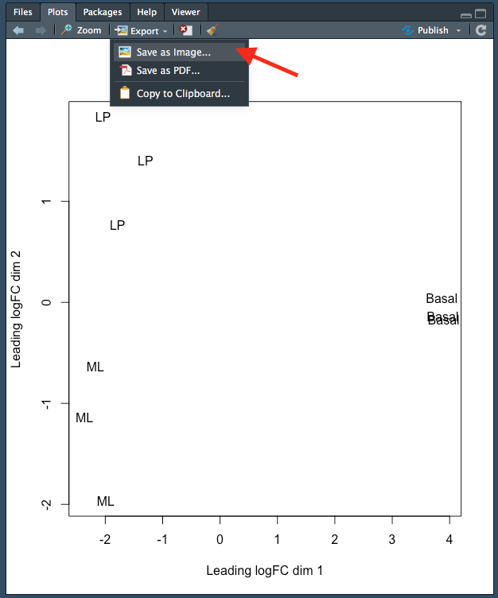

```{r, include=FALSE}
library(knitr)
opts_chunk$set(tidy.opts=list(width.cutoff=80),tidy=TRUE)
```


# Session 4
```{r, echo=FALSE, warning=FALSE}
library(knitr)
library(kableExtra)
```

In this session we will run through the basic steps for analysing a simple RNA-seq experiment using the limma-voom workflow. This includes:

* filtering out lowly expressed genes
* normalisation
* creating a multidimensional scaling (MDS) plot 
* creating a design matrix
* fitting gene-wise linear models (with empirical Bayes moderation to more accurately estimate gene-wise variability) 
* performing statistical testing for differential expression

The aim of this session is to give you experience with a real-world RNA-seq analysis, and making extensive use of an external library. We will not cover the statistics in any depth. In general analysis packages will want your data in some specifc format, so it's important to be able to manipulate the data to fit the package's requirements.


## DGEList

Let's start by re-creating our `DGEList` object:

```{r, warning=FALSE}
# load required packages
library(edgeR)
library(limma)

# vector of file names
files <- c("GSM1545535_10_6_5_11.txt", "GSM1545536_9_6_5_11.txt", 
   "GSM1545538_purep53.txt", "GSM1545539_JMS8-2.txt", 
   "GSM1545540_JMS8-3.txt", "GSM1545541_JMS8-4.txt", 
   "GSM1545542_JMS8-5.txt", "GSM1545544_JMS9-P7c.txt", 
   "GSM1545545_JMS9-P8c.txt")

# create DGEList object
dge <- readDGE(files, path = "data", columns = c(1,3))

# add sample names
samplenames <- c("10_6_5_11", "9_6_5_11", "purep53", "JMS8-2", "JMS8-3",
                 "JMS8-4", "JMS8-5", "JMS9-P7c", "JMS9-P8c")

colnames(dge) <- samplenames

# add phenotype group information
group <- as.factor(c("LP", "ML", "Basal", "Basal", "ML", "LP", "Basal", "ML", "LP")) 
dge$samples$group <- group

# add gene annotation information
dge$genes <- read.delim("data/Ses3_geneAnnot.tsv", stringsAsFactors = FALSE)
```

## Filtering

The first step is to filter out lowly expressed genes. There are two main problems with low abundant genes:

* Technical variation is more problematic for low abundance genes. This variation is thought to be due to two factors; insufficient mixing and low sampling fraction [@mcintyre2011rna]. 
    * Insufficient mixing of solutions during library preparation can result in uneven distribution of reads. 
    * RNA sequencing can be thought of as sampling. Measurement errors will occur simply due to the random nature of the sampling process. This problem affects lowly abundant RNA species more because the relative error for small count values is larger than it would be for more highly abundant RNA species.
* Biologically, genes that are expressed at low, biologically not meaningful, levels are not of interest.

Additionally, genes that have a count of 0 across ALL samples are also removed, simply because they provide no useful information.

Removing these highly variable, lowly expressed genes increases your 'power' to detect differentially expressed genes [@bourgon2010independent]. To test for differential expression, a statistical test must be conducted for every gene. There are a large number of genes - meaning that a large number of statistical tests must be performed. When you perform many statistical tests, many will produce small p-values by chance alone. We must account for these false positives. There are a number of methods to do this and these are broadly called 'adjusting for multiple testing'. This adjustment reduces the number of false positives but comes at the cost of reduced 'power' to detect true positives. If we filter out uninteresting, lowly expressed genes, we need to perform fewer statistical tests and reduce the impact that multiple testing adjustment has on detection power. 

The `filterByExpr()` function provides an automatic way to filter genes.

By default, it keeps genes with a count of 10 or more in a minimum number of samples. This minimum number of samples is the smallest phenotype group. In our experiment, there are 3 phenotype groups each with 3 samples. Filtering is therefore performed such that genes with a count of 10 in at least 3 samples are kept and the rest filtered.

Note that the actual filtering is done using counts per million (NOT the raw count value). This is to prevent bias against samples with small library sizes.

The output of this function is a vector of logicals, indicating which genes (rows) should be kept and which filtered.

```{r}
keep <- filterByExpr(dge, group = group)
head(keep)
```


```{r}
dge <- dge[keep,, keep.lib.sizes=FALSE]
dim(dge$counts)
```

We can see that we now have 16624 genes. We started with 27179 genes - meaning that ~40% of genes have been filtered out.

## Normalisation

The aim of normalisation is to remove systematic technical effects. There are two main factors that need to be normalised for in RNA-seq:

* Sequencing depth/library size - technically, sequencing a sample to half the depth will give, on average, half the number of reads mapping to each gene [@robinson2010scaling].
* RNA composition - if a large number of genes are unique to, or highly expressed, in one experimental condition, the sequencing 'read estate' available for the remaining genes in that sample is decreased. For example, let's say we have 2 samples, A and B. Both contain the same set of genes which are also expressed at the same level. In sample A however, there are also many genes that are not expressed in sample B. Each sample is sequenced to the same depth. The genes that are present and actually expressed equally in the two samples will have fewer sequencing reads in sample A. This is because the genes present in sample A but NOT present in sample B are taking up a portion of the sequencing 'real estate'. As a result there is less reads 'available' to the other genes (the ones present in both samples). This means that the 'proportion o reads attributed to a given gene in a library depends on the expression properties of the whole sample rather than just the expression of that gene [@robinson2010scaling]. 

Sequencing depth is accounted for by calculating the counts per million (cpm). This metric is calculated by:

1. taking the library size (sum of all counts for a sample), 
2. dividing this by 1,000,000 to get the 'per million' scaling factor,
3. then dividing all read counts for each gene in that sample by the 'per million' scaling factor

RNA composition can be accounted for by using more sophisticated normalisation methodologies. We will use 'trimmed mean of M-values' (TMM), which estimates relative RNA levels from RNA-seq data [@robinson2010scaling]. TMM calculates a library size scaling factor for each library (sample). This is done using the following steps:

1. calculate the gene expression log fold changes and absolute expression values for pair-wise samples (selecting one sample from the experiment as a reference)
2. remove the genes with the highest and lowest fold changes and absolute expression values
3. take a weighted mean of the remaining genes (where the weight is the inverse of the approximate asymptotic variances). This gives the normalisation factor for each library (sample)

TMM, like most normalisation methods, assumes that the majority of genes are NOT differentially expressed.

Subsequent steps in this analysis will use log-cpm values, calculated using the normalisation factors, which 'scale' each library size.

We can calculate the normalisation factors, specifying that we want to use the `"TMM"` method:

```{r}
dge <- calcNormFactors(dge, method = "TMM")
```

This function calculates the normalisation factors for each library (sample) and puts this information in the `samples` dataframe. Note that it takes dge (our `DGEList` object as input) and returns a `DGEList` object as well.

Let's take a look at our normalisation factors:

```{r}
dge$samples$norm.factors
```

These normalisation factors are all close to 1 for all samples, suggesting minimal difference in 'relative RNA levels' between samples.

## MDS

MDS is a way to visualise distances between sets of objects (samples in our case). It is also a dimensionality reduction technique, like principal components analysis (PCA). Given a matrix of distances between each pair of objects (samples in our case), it tries to place each object in a lower dimensional space, usually 2 or 3 so it can be plotted, such that the distances between each data points is preserved as well as possible.

>Note on dimension reduction:
>
>Dimension reduction describes the process of converting a data with many dimensions (which can be thought of as 'variables') into data with fewer dimensions, while retaining as much information as possible. There are a number of reasons why we may want to do this. In RNA-seq experiments specifically, the main advantage of dimension reduction is to allow visualisation and exploration your data. Take for example, a gene expression experiment where the expression level of only 2 genes are measured in a number of samples. We can easily visualise this by plotting a scatter graph where gene 1 expression is on the y axis and gene 2 expression is on the x axis (or vice versa) and each point is a sample. In RNA-seq experiments however, we generally measure the expression of over 10,000 genes. It would be impossible to visualise such data as we would need to have over 10,000 axes (as we have over 10,000 genes) in our graph. What we would like to do, is to transform the high-dimensional data into data with with only 2 or 3 dimensions that conveys the same information. We could then visualise the data on a plot with 2 or 3 axes. Information is inevitably lost during the dimension reduction process, though all methodologies aim to preserve as much information as possible. 

The `plotMDS()` function performs MDS on a `DGEList` object using metric MDS. The distances between each sample in the resulting plot can be interpreted as the typical log2-fold-change between the samples, for the most different genes (genes that have the most different expression values between that pair of samples).

Let's take a look at the plot created from `dge`, our `DGEList` object:

```{r}
plotMDS(dge)
```

Each point on the plot represents one sample and is 'labelled' using the sample name.

We can change the labelling to use the name of the group the sample belongs to instead:

```{r}
group
```

```{r}
plotMDS(dge, labels = group)
```

This shows us that the phenotype groups tend to 'cluster' together, meaning that the gene expression profiles are similar for samples within a phenotype group. The 'Basal' type samples quite close together while the 'LP' (luminal progenitor) and 'ML' (mature luminal) type samples are further apart, signifying that their expression profiles are more variable.

To make the three phenotype groups more distinct in our graph, we are going to colour samples from each group differently. To do this, we will use the `col` argument in `plotMDS()`. `col` takes in a vector the same length as the number of points in the plot (9 in our case, as there are 9 samples). Each element of the vector should be a colour name (R understands [over 600 colour names](http://www.stat.columbia.edu/~tzheng/files/Rcolor.pdf)), indicating what colour that sample should be.

To make this more clear, take a look at the table below, which lists all the samples and the phenotype group they belong to:

```{r, echo=FALSE}
kable(
  data.frame(Samples = rownames(dge$samples), Group = group)
) %>%
  kable_styling(full_width = F)
```

For example, let's say we wanted LP samples to be coloured green, ML samples to be coloured red and Basal samples to be coloured blue. The `col` argument would then require a vector that looks like this:

```{r, echo=FALSE, eval=TRUE}
groupCol <- group
levels(groupCol) <- c("blue", "green", "red")
groupCol <- as.character(groupCol)
groupCol
```

Of course, we don't want to type out this vector ourselves. We want to make R do this. This is less tedious and error prone.

We can do this using the `group` vector. Recall this factor vector gives the phenotype groups of each sample (in the same order as the samples are in within `dge`, our `DGEList` object).

```{r}
group
```

We don't want to change this vector, so we will 'copy' the vector `group` to a new variable called `groupCol`:

```{r}
groupCol <- group
```

We can now create our character vector. I will guide you through this in the next challenge.

**Challenge 4.1**

1. The `levels` function gives all the 'categories' of a factor vector. If we run it on `groupCol`, it will give our 3 phenotypes:

```{r}
levels(groupCol)
```

Replace the current levels (categories) of `groupCol` with a character vector containing 3 colour names of your choosing. Inspect the resulting `groupCol` vector to make sure it has done what you expected it to.

*Hint*: the notation for this is similar to creating and replacing a new column - see Section \@ref(vect) for details.

2. We need to give the argument `col` a character vector of colour names, NOT a factor vector. Convert `groupCol` from a factor vector to a character vector. Inspect the resulting `groupCol` vector to make sure it has done what you expected it to.

*Hint*: see section \@ref(factors) to review the commands to convert between data types.

3. Use `plotMDS()` and the `col` argument to re-plot the MDS plot with phenotype colours.

### Plotting

There are two *phases* to making plots with base R: 

1. 'Initialising' a new plot, e.g. done with a 'plot' function like `plot()` or `plotMDS`.
2. Adding to an existing plot, e.g. adding a legend. 

We will explore adding base R plot annotation in the following challenge.

**Challenge 4.2**

1. Re-create the MDS plot with the sample names as labels and the labels coloured by phenotype group - i.e. the plot below:

```{r, echo=FALSE}
groupCol <- group
levels(groupCol) <- c("blue", "green", "red")
groupCol <- as.character(groupCol)
plotMDS(dge, col = groupCol)
```

2. Add a title to your graph using the `main` argument to the `plotMDS()` function. Remember to give your title as a character.

3. Notice that the label of sample '9_6_5_11' is cut off. Amend this by changing the 'limits' of the x axis using the `xlim` argument to the `plotMDS()` function. `xlim` takes a numeric vector containing 2 elements, the min and max values of the x axis.

4. Add a legend to your plot using the `legend()` function. This function adds to an existing plot and thus should be run after the `plotMDS()` function. Useful arguments to `legend()` include:

* `x` - the position of the legend. It can be one of: "bottomright", "bottom", "bottomleft", "left", "topleft", "top", "topright", "right" or "center".
(technically you could also specify the position of the legend using `x` and `y` coordinates but we will not do this in the course)
* `legend` - a character vector specifying the text to display in the legend. Here it would be the names of the phenotype groups.

*Hint*: you can use function `levels()`, which provides categories of a factor vector.

* `text.col` - a character vector specifying the colours of the text in the legend. As there are 3 phenotype groups in our case, there should be 3 colours in this vector. These should also be the same colours as the labels within the plot.

*Hint*: this should be the same vector of colour names used to create the `groupCol` vector.

## Saving plots

You can save plots in RStudio in the 'Plots' tab on the bottom right. After creating your plot, click on `Export` > `Save as Image...`:

```{r save1, fig.cap="Saving a plot in RStudio.", out.width="500px", fig.align='center', echo=FALSE}

```

This will open up a new window where you can:

1. Specify the image file format you wish to save as. Options include png, tiff and jpeg.
2. Specify the dimensions of the plot in pixels.
3. Name your file. The plot will be saved in your working directory.

Each step is indicated by an arrow and number below:

```{r save2, fig.cap="Specifying the file type, dimensions and name of the plot.", out.width="500px", fig.align='center', echo=FALSE}
knitr::include_graphics("Images/saveim2.png")
```

Note that you can also save your plot as a pdf using 'Export > 'Save as PDF...'.


## Linear modelling

The next step of the limma-voom analysis is to fit a linear model for each gene. A linear model is a broad class of statistical models that predict a variable of interest using one or more 'explanatory' (also called 'predictor') variables. The most basic type is linear regression, which models the relationship between a continuous variable and continuous or categorical 'explanatory' variables. It uses an equation that looks like this: 

$Y = \beta_{0} + \beta_{1}X_{1} + \beta_{2}X_{2}...$ 

This equation is essentially saying that a response variable of interest $Y$ is equal to a constant ($\beta_{0}$), plus a parameter multiplied by a predictor variable ($\beta_{1}X_{1}$), plus a second parameter multiplied by a second predictor variable ($\beta_{2}X_{2}$), and so on until there are no more predictor variables. There are many other types of linear models, including logistic regression and analysis of variance, but all predict a response variable of interest using explanatory variable(s).

It is important to note that the word 'linear' in linear model does not mean 'straight line'. 'Linear' actually describes the relationship between the parameters of the model equation and the response variable (technically the response variable must be a linear combination of the parameters but this is outside the scope of this course). A linear model equation can describe a straight line but does not have to.

Although our experiment has a simple design, with 3 different cell types, limma's linear model approach has the ability to accommodate very complex experimental designs. Before we can fit our linear model, information about the experimental design needs to be provided to the model. This is done using a 'design matrix'.

### Design matrix

A design matrix provides your linear model with information about each sample in your experiment. Thus, in our experiment a design matrix would specify which of the 3 cell type 'groups' each sample belongs to. Take a look at the design matrix below: 

```{r}
design <- model.matrix(~0 + group)
design
```

There are 9 rows, one for each sample. Along each row, a '1' indicates the cell type 'group' the sample belongs to and '0' indicates cell type groups the sample does not belong to. You can think about the '1' and '0' as turning a cell type group 'on' or 'off'. Finally, notice how one sample only belongs to one cell type group.

Let's take a look at how to generate a design matrix. We used the function `model.matrix()`, which took the 'expression' `~0 + group`. Recall that `group` is a factor vector that specifies which cell type group each of the 9 samples belongs to:

```{r}
group
```

The `~` at the start tells R that we want to model the samples using the 'expression' to the right of the `~`. The `0` at the start tells R not to include an intercept. We have chosen not to include an intercept because it is easier to interpret but including the intercept is just as valid. 

**Challenge 4.3**

Change the name of the columns of our design matrix (`design`) such that the word 'group' is not in front. 

*Hint*: use the function `colnames()`.


### Contrasts

'Contrasts' let us ask specific questions, for example, if we want to compare expression between two specific groups. In our experiment, we are interested in the difference between each pairwise group. A contrast matrix can be made using the `makeContrasts()` function. Within this function, we specify the name of each specific contrast and the formula for that contrast. For example, the `BasalvsLP` contrasts compares the difference between the `Basal` and `LP` groups. Note that the name of the phenotype groups must be written exactly as they are in the column names of our design matrix (see above). 

The final input to the `makeContrasts()` function is simply the names of each cell type group (recall from above that `colnames(design)` gives the names of each cell type group).

The creation and output of our contrast matrix is shown below:

```{r, echo=FALSE}
colnames(design) <- c("Basal", "LP", "ML")
```


```{r}
contr.matrix <- makeContrasts(
   BasalvsLP = Basal - LP,
   BasalvsML = Basal - ML, 
   LPvsML = LP - ML,
   levels = colnames(design))
contr.matrix
```

Notice that the sum of all the numbers along each COLUMN is 0. The first column is the contrast for the difference between Basal (1) and LP (-1). 

### Linear model fitting

We are now ready to fit our linear models. Limma fits linear models to the data with the assumption that the underlying data is normally distributed. Count data is however, not normally distributed. We must therefore, 'normalise' our count data first. To do this, limma first transforms the raw count data to log-cpm using library sizes and the normalisation factors we calculated previously. The mean-variance relationship of the log-cpm data is then accommodated using precision weights. These precision weights are calculated using the `voom()` function. 

The `voom()` function takes as arguments, our `DGEList` object and our design matrix. It also optionally outputs a plot of the mean-variance relationship of our data, called the 'voom-plot'. Each point on the voom plot is a gene. On the x and y axes are the log2 of the count value + 0.5 (to prevent taking the log of 0) and the square root of the standard deviation of that gene, respectively. Typically the voom plot shows 'variance' decreasing as expression increases. Variance will generally plateau (i.e. remain at the same level) at high expression values. In experiments with higher biological variation, this plateau will be at a higher variance level. For example, experiments using mice as biological replicates will generally have higher variation than experiments using cell lines as biological replicates. As a result, the plateau will be at a higher variance level.

```{r}
v <- voom(dge, design, plot = TRUE)
```

The output of `voom()` (our variable `v`) is an `EList` object which contains the following elements:

* `E` - numeric matrix of normalised log-cpm values.
* `weights` - numeric matrix of precision weights.
* `design` - the design matrix we gave as an argument to `voom()`.
* `genes` - a dataframe of gene annotation data. This is the same as the element `genes` from our `DGEList` object `dge`.
* `samples` - dataframe of sample data. This is the same as the element `samples` from our `DGEList` object `dge`.

The `EList` object can also contain information about the voom plot, if you choose to save this plot when you ran the `voom()` function.

Let's take a look at `E`:

```{r}
head(v$E)
```

Each column is a sample and each row is a gene (called a 'Tag').

We are now ready to fit our linear model with `lmFit()`, which calculates coefficients we defined in our design matrix (`design`). The resulting object, `vfit` is a `MArrayLM` object. It contains a information about our genes (the same dataframe as `genes` from our `EList` object `v` above), the design matrix and a number of statistical outputs. Of most interest to us is the coefficients, stored in an element called `coefficients`. The first rows of this matrix is shown below. Each gene is row and is labelled using the EntrezID. Each column gives coefficients for each of our phenotype groups.

```{r}
vfit <- lmFit(v, design)
head(vfit$coefficients)
```

We can then use `contrasts.fit()` to calculate coefficients for each contrast (or 'comparison') we specified in our `contr.matrix`. The output is also an object of the class `MArrayLM` (also known as an `MArrayLM` object). When we inspect the `coefficients` element now, we can see that each column is a contrast that we specified in our contrast matrix.

```{r}
vfit <- contrasts.fit(vfit, contrasts = contr.matrix)
head(vfit$coefficients)
```

## Statistical testing

The next step is to carry out statistical testing to determine which genes are differentially expressed. The function `eBayes()` computes moderated t-statistics, moderated F-statistics and log-odds of differential expression for each gene, given a fitted linear model. 'Moderated' refers to empirical Bayes moderation, which borrows information across genes to obtain more accurate measures of variability for each gene. This also increases our power to detect differentially expressed genes. 

```{r}
efit <- eBayes(vfit)
```

We can now look at the number of differentially expressed genes using the `decideTests()` function. The output of this function is a matrix where each column is a contrast (comparison of interest) and each row is a gene. The numbers 1, -1 and 0 mean up-regulated, down-regulated or not significantly differentially expressed, respectively. 

Note that `decideTests()` also accounts for multiple testing. The default method is Benjamini and Hochberg [@benjamini1995controlling] but several others are also available.

```{r}
decideTests(efit)
```

To obtain the total number of differentially expressed genes for each comparison, we can add the function `summary()`:

```{r}
summary(decideTests(efit))
```

The function `topTable()` can be used to obtain more information on the differentially expressed genes for each contrast. `topTable()` takes as arguments the `MArrayLM` object output by `eBayes()` (`efit`), the contrast name of interest and the number of top differentially expressed genes to output. Note that the contrast name must be given in quotes and must be exactly as written in the contrast matrix (`contr.matrix`). 

It outputs a dataframe with the following information:

* **Gene details** - gene information, from the `gene` element of the `MArrayLM` object (`efit`).
* `logFC` - the log2 fold change of the contrast.
* `AveExpr` - the average log2 expression of that gene.
* `t` - moderated t-statistic.
* `P.Value` - p value.
* `adj.P.Val` - adjusted p value.
* `B` - log-odds that the gene is differentially expressed.

```{r}
topTable(efit, coef = "BasalvsLP", n = 5)
```


**Challenge 4.4**

Using `topTable()`, output a dataframe with the top 100 genes for the LP vs ML comparison and write this out to a tsv file called "LPvsML.tsv".

**Hint**: we did this in the first session in Section \@ref(write).

## Answers

**Challenge 4.1**

```{r}
#1 
levels(groupCol) <- c("blue", "green", "red")
groupCol
# 2
groupCol <- as.character(groupCol)
groupCol
# 3
plotMDS(dge, labels = group, col = groupCol)
```

**Challenge 4.2**

```{r}
groupCol <- group
levels(groupCol) <- c("blue", "green", "red")
groupCol <- as.character(groupCol)
plotMDS(dge, col = groupCol, main = "MDS plot coloured by cell type",
        xlim = c(-2.8,4))
legend("topright", legend = levels(group), 
       text.col = c("blue", "green", "red"))
```

**Challenge 4.3**

```{r, eval=FALSE}
colnames(design) <- c("Basal", "LP", "ML")
```

**Challenge 4.4**

```{r, eval=FALSE}
topLPvsML <- topTable(efit, coef = "LPvsML", n = 50)

write.table(x = topLPvsML, file = "LPvsML.tsv", sep = "\t",
            row.names = FALSE, col.names = TRUE)
```
