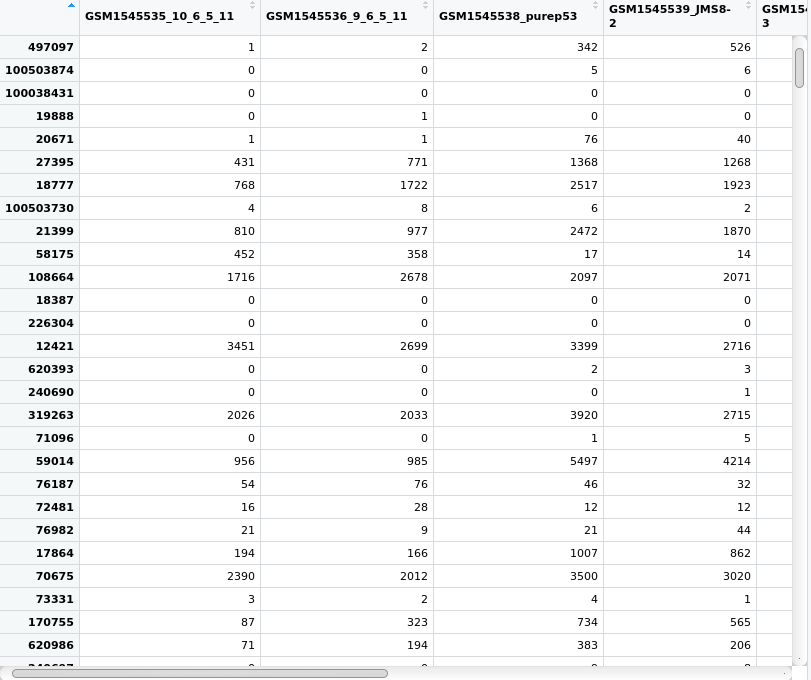

--- 
title: "Introduction to Base R"
author: "Lucy Liu"
date: "`r Sys.Date()`"
site: bookdown::bookdown_site
output: bookdown::gitbook
documentclass: book
bibliography: [ref.bib]
biblio-style: apalike
link-citations: yes
github-repo: lucyleeow/BaseR_Intro
description: "Introductory tutorial to base R, with a biological focus. In particular it will focus on analysing RNA-sequencing data with Bioconductor."
---

# Preface {-}

This introduction to base R course was designed for biologists with no previous programming experience. It has a focus on analysing RNA-sequencing data using the [Bioconductor](https://www.bioconductor.org/) package [limma](https://bioconductor.org/packages/release/bioc/html/limma.html). The F1000 paper ['RNA-seq analysis is easy as 1-2-3 with limma, Glimma and edgeR'](https://f1000research.com/articles/5-1408/v3) was used as a guide for the latter sessions.

It is intended to be delivered over four 2.5 hour workshops at the Walter and Eliza Hall Institute of Medical Research (WEHI).

## Data files

The data files require for this workshop are available on [Github](https://github.com/lucyleeow/BaseR_Intro/tree/master/data). To download a data file click on the file you wish to download then right click 'Raw' > 'Save Link As...':


**Acknowledgements**

* Thank you to [Shian Su](https://github.com/Shians), [Brendan Ansell](https://github.com/bansell) and [Professor Gordon Smyth](https://github.com/gksmyth) for your suggestions and review of this tutorial.
* This page was generated using the [bookdown](https://bookdown.org/) package by [YiHui Xie](https://yihui.name/). 


The source code for this page can be found on [Github](https://github.com/lucyleeow/BaseR_Intro).


<!--chapter:end:index.Rmd-->

# Session 1

In this first session we will learn about:

* R and RStudio
* data types and data structures
* vectorisation
* how to read in and write out data

## R and RStudio

R is a free and open source statistical programming language, great for performing data analysis. RStudio is a free and open source R integrated development environment (IDE) which makes it easier for you to write code. It does this by providing you with auto-completion (of variable names, function names, file paths etc.), helping with formatting and keeping track of your variables.

You can think of R as the engine in a car and RStudio as the body & controls. R is doing all the calculations/computations but RStudio makes it easier for you to use R.

When you first open RStudio, there will be three panels - see Figure \@ref(fig:RS1) (don't worry if your RStudio does not have the same colours/appearance - different versions of RStudio look slightly different and the text colour I use is not the default one.)

```{r RS1, fig.cap='Three panels in RStudio.', out.width="700px", echo=FALSE}
knitr::include_graphics("Images/RS1.png")
```

* Left panel: this panel features two tabs, 'Console', which is where you can type in commands for R to run and 'Terminal', which we won't worry about in this course.
* Top right panel:
    * Environment - in this tab you can see all variables you have created.
    * History - R keeps track of all commands you have run and you can review them in this tab. 
    * Connections - this tab helps you connect to data sources but we will not be using it in this course.
* Bottom right:
    * Files - you can explore your file directory here and we will use it to set our working directory later.
    * Plots - plots that you create will either appear here or be saved to a file.
    * Help - help files for R functions can be viewed in this tab. Help files tell you about what a function does and how to use it.
    * Packages - basic R includes many useful functions. You can add even more functions by downloading packages. A package is a collection of functions, generally with a certain data analysis theme. For example, the package 'limma', which we will use later, includes functions for analysing RNA-sequencing data.
    * Viewer - this tab lets you view local web content but we won't be using it in this course.
    
## R scripts

To open a R script, go to File > New File > R Script.

```{r RS2, fig.cap='Opening a new R Script.', out.width="700px", echo=FALSE}
knitr::include_graphics("Images/RS2.png")
```

This will open a fourth panel on the top left. 

```{r RS3, fig.cap='Four panels, including a R Script.', out.width="700px", echo=FALSE}
knitr::include_graphics("Images/RS3.png")
```

A R Script is just a text document. You can type and run commands using a R Script and down in the Console - the difference is that you can't save the commands you run in the Console but you can save the R Script with all your commands. Note that to run a command in the Console press `Enter` key but to run a command in a R Script you must press `Cmd/Ctrl + Enter` keys.

Lastly, you can make 'comments' in your R Script. Comments are notes to yourself that are not interpreted by R and start with `#`:

```{r}
# this is a note to myself
1+3-2
```

## Help

There are two ways to access help files in RStudio. You can type in the name of the function you want help with, in the top right of help tab (indicated with a red arrow):

```{r help, fig.cap="Accessing help files via 'help' tab.", out.width="500px", fig.align='center', echo=FALSE}
knitr::include_graphics("Images/help.png")
```

The other option is to run the command `?` followed by the name of the function:

```{r, eval=FALSE}
?sum
```

Help files are very useful but can be difficult to interpret at first due to the technical language used. We won't get too much practice reading help files during this course but I would encourage you to try to use them when figuring out how to use a new function.

## Working directory

Every file on your computer is located in a specific location. This location can be referred to by a path. In Mac, paths look something like this: `/Users/Lucy/Documents/`. In Windows, paths look something like this: `C:\Users\Lucy\Documents\`. 

When you open a R session, it launches from a specific location. You can find out where this is using the command `getwd()`. This location called the 'working directory'. R will, by default, look in this directory when reading in data and write out files/plots to this directory. It is often useful to have your data and R Scripts in the same directory and set this as your working directory.

You can set your working directory to be anywhere you like and we will now do this:

1. Make a folder for this course, somewhere sensible on your computer that you will be able to easily find. 
2. Go back to your RStudio window, go to the bottom right panel, click on the 'Files' tab and then click on the three dots on the top right hand corner (Figure \@ref(fig:wd1)).

```{r wd1, fig.cap='Setting the working directory - 1.', out.width="500px", echo=FALSE, fig.align='center'}
knitr::include_graphics("Images/wd1.png")
```

3. This will open up a new window (Figure \@ref(fig:wd2)) which lets you explore the files and folders on your computer. Find the new folder you created, click on it then click 'Open'.

```{r wd2, fig.cap='Setting the working directory - 2.', out.width="500px", echo=FALSE, fig.align='center'}
knitr::include_graphics("Images/wd2.png")
```

4. The files tab will now show the contents of your new folder (which should be empty). At the top of the files tab, click on More > Set As Working Directory (Figure \@ref(fig:wd3)).

```{r wd3, fig.cap='Setting the working directory - 3.', out.width="500px", echo=FALSE, fig.align='center'}
knitr::include_graphics("Images/wd3.png")
```

Please set your working directory to be this folder at the start of EVERY session.

## Maths

R performs maths and follows standard order of operations. In order of highest to lowest precedence, here is how mathematical operations are denoted in R:

* `()` - parentheses
* `**` or `^` - exponents
* `/` - divide
* `*` - multiply
* `+` - add
* `-` - subtract

Another useful function is modulus (`%%`), which gives the remainder after dividing:

```{r}
8%%3
```

## Comparisons {#comps}

You can also compare numbers in R:

```{r}
1 == 1  # equal to.
1 != 1 # not equal to
2 > 1   # greater than.
2 < 1   # less than.
1 <= 2  # greater or equal to.
1 >= 2  # less than or equal to.
```

The `!` sign by itself means "not" and it reverses the logical. For example, "not" TRUE is FALSE.

```{r}
!TRUE
```

You can also compare words. What do you think will happen below?

```{r}
"cat" > "dog"
```

R will use alphabetical order to determine which word is 'greater':

```{r}
"a" < "b"
```

## Variables

A variable in R is just a name which refers to an 'thing' (more technically an 'object' in R).

For example, I can do some maths:

```{r}
2 + 6 * 7**2
```

R outputs the result. However, if I want to 'save' this result to use later, I need to 'assign' the output to a variable. This can be thought of as giving it a name, so that we can refer to it later.

You can this with `<-` (shortcut = `alt + -`) in R. (You can also use `=`, however stylistically `<-` is preferred.)

Here R performs the calculation on the right of `<-` and then saves the result as a variable called `my_num`.

```{r}
my_num <- 2 + 6 * 7**2
```

Now if I run the command `my_num`, I see the number I stored earlier:

```{r}
my_num
```

You can also 'overwrite' variables:

```{r}
my_num <- 3 * 4
```

The above code evaluates `3 * 4` and assigns the output to the variable `my_num` - effectively 'overwritting' the previous value assigned to it.

```{r}
my_num
```

R is particular about variable names. Variable names cannot:

* start with a number 
* contain any spaces

If we try to create a variable that starts with a number, R will return an error:

```{r, error=TRUE}
2myvar <- 2 + 6 * 7**2
```

### Errors and warnings

This is a good time to talk about 'errors' and 'warnings' in R.

An *error* is R telling you that it couldn't do what you told it to do. Do not be disheartened at seeing an error message - it happens to everyone, including experienced programmers, all the time. DO read the error message, it is often very useful and tells you what you need to do to fix the error.

A *warning* is R telling you that is has done what you told it to do, however the result may not be what you want. Sometimes it is okay to ignore a warning, sometimes it is not!

## Data structures

A data structure can be thought of as a 'container' for data. There are a number of different data structures in R and each have different specifications about how data is stored. 

Three commonly used data structures are summarised below:

```{r dstruct, fig.cap='Data structures. Source: http://libguides.wellesley.edu.', out.width="700px", echo=FALSE, fig.align='center'}
knitr::include_graphics("Images/data-structure.png")
```

Another useful data structure is a 'list', which we will talk about in Session 3.

### Vector

You can think of a vector like a row or column in excel. You can only store one *type* of data in a vector - e.g. all numbers or all text.

You can create vectors with the `c()` function ('c' for 'combine'):

```{r}
my_vect1 <- c(1,2,3)
my_vect2 <- c("a", "b", "c")
```

### Matrix

A matrix is like an excel spreadsheet. It is two dimensional meaning you have columns and rows of data. You can only store one *type* of data in a matrix - e.g. all numbers or all text.

### Dataframe

Dataframes are also two dimensional (has both rows and columns) however, you can store different types of data in a dataframe. The only restriction is that all the data within one column must be of the same type.

A dataframe is composed of vectors, with each vector being one column. You can create a dataframe using the `data.frame()` function:

```{r}
my_df <- data.frame(
  cats = c("Hello Kitty", "Garfield"), 
  weight = c(4.5,7)
)
my_df
```

There are a few important things to note:

1. `name` and `age` become the names of the columns.
2. the `,` at the end of `cats = c("Hello Kitty", "Garfield")` is important and should not be missed.
3. each column in a dataframe is essentially a vector. Do not forget the `c()` when inputing the values within each column.

You can access a column in a dataframe with the shortcut `$`. Notice that the names of all columns of the dataframe appears after typing in `my_df$`:

```{r dfdollar, fig.cap="Accessing columns in a dataframe using the '$' symbol.", out.width="350px", echo=FALSE, fig.align='center'}
knitr::include_graphics("Images/df_dollar.png")
```

**Challenge 1.1**

Create a dataframe called `my_df2` with 2 columns. The first column named "dogs" should be a vector with the values: "spot", "snoopy". The second column named "weight" should be a vector with the following values: 3.5, 4.8.

Write this dataframe out to a .tsv file named 'Ses1_dogs.tsv'.

## Reading in data

Let's read in some data and start exploring it. 

You should have received the data files via email before the course. Please download these files and make sure they are located in your working directory. Recall, we set our working directory above. You can find the location of your working directory with the function `getwd()`. 

If you are following along outside of the WEHI course, you can download the data files from [Github](https://github.com/lucyleeow/BaseR_Intro/tree/master/data) - instructions for downloading data from GitHub can be found in the Preface.

The file we want to read in is named 'Ses1_genes.tsv'. 

I have put all my data files in a directory called 'data' - thus the path to the file (relative to my working directory) is 'data/Ses1_genes.tsv'. Depending on where you have put your data (in your working directory or in another file in your working directory), the path to your file 'Ses1_genes.tsv' may be different.

Read in your data by typing in the path to your 'Ses1_genes.tsv' file (relative to your working directory), within the brackets `( )`:

```{r}
read.delim("data/Ses1_genes.tsv")
```

Note that `read.delim()` also lets you specify what kind of file you are reading in - by this I mean how each value is separated. Two common formats are 'csv' (comma separated values) and 'tsv' (tab separated values).

Example of csv file:
```
Name, Age
Andy, 10
Bob, 8
```

Example of tsv file:
```
Name  Age
Andy  10
Bob   8
```

Notice in the above two examples the values are separated by different 'characters'.

You can specify what 'character' separates each value by using the `sep` input in `read.delim()`. E.g. if your file was a csv, you can read it in using:

```{r, eval=FALSE}
read.delim("file.csv", sep = ",")
```

We don't need to specify the `sep` for our file, which is a tsv, as the default separater `read.delim()` is tab. We only need to specify the separater character when we are reading in a file NOT separated by tabs.

Above, we have read in our data as a dataframe and printed it. However, we can't refer to this dataframe again and manipulate it because we haven't assigned it to a variable.

Let's assign our dataframe to a variable called `genes`:

```{r}
genes <- read.delim("data/Ses1_genes.tsv")
```

Notice how `genes` now appears in our 'Environment' tab:

```{r import, fig.cap="Variable in 'Environment' tab.", out.width="500px", echo=FALSE, fig.align='center'}
knitr::include_graphics("Images/import.png")
```

All variables that we create will be shown in this tab, so it is a useful way to keep track of variables that we have created. Notice how R also tells us that there are 10 observations (rows) and 3 variables (columns) in the `genes` dataframe.

### Summary

A useful function for investigating your data is `summary()`. Running this function on our `genes` dataframe provides us with summary statistics on all the numeric columns. For the columns that don't contain numbers, the output simply states the length of that column.

```{r}
summary(genes)
```

### Structure

A useful function for understanding how our data is stored in R is `str()` (structure). 

```{r}
str(genes)
```

The output tells us that `genes` is a dataframe. It also tells us what *data type* each column is. 

## Data types

Every bit of data in R has a 'data type label'. The label doesn't change the data in any way - it just tells R what kind of data it is and thus what it can and can't do with the data.

For example, it makes sense to perform mathematical functions on numbers but not on words. It makes sense to look for a certain term, like a gene name, in words but not in numbers.

For example, you can't add words so the code belwo doesn't work. Note that quotes (`" "` or `' '`) ALWAYS surround values that are of the 'character' data type:

```{r, error=TRUE}
"one" + "two"
```

This does work because they are numbers:

```{r}
1 + 2
```


There are five basic types of data in R:

* `logical` - either TRUE or FALSE. This is useful for data that only has two possible values, like if patient has a disease or not.
* `integer` - number without decimal point e.g. `3`.
* `double` - number with decimal point e.g. `3.14`.
* `complex` - complex number with a real and imaginary part e.g. `1 + 3i`
* `character` - Anything with character(s) within it. Quotes (double or single) signify this data type e.g. `"pi"`. Also known as a 'string'.

In our `genes` dataframe above, we can see that both the `GeneLength` and `Count` columns are integers ('int'). But what is the `SYMBOL` column? It is a 'Factor'.

### Factors {#factors}

Factor is a data type label used for categorical variables (e.g. small, medium and large OR red, blue and green). Internally, R stores factors as numbers (integers), with each number corresponding to a category.

For example, if your data was:

```
red, blue, green, red, green
```

Internally, R would store the data as:

```
1, 2, 3, 1, 3
```

Each number corresponds to a category. This information is also stored. In R, the categorical values each number corresponds to, is called 'levels'.

The levels for the above data would be:

```
1 = red
2 = blue
3 = green
```

Factors can be difficult to work with, so we don't want our gene symbols to be 'labelled' as factors. We can do this by specifying this when reading our data in:

```{r}
genes <- read.delim("data/Ses1_genes.tsv", stringsAsFactors = FALSE)
```

By default, R will label all word ('character') data as a 'factor'. Setting `stringsAsFactors` to be `FALSE`, tells R that you DON'T want it to do this.

We can check the structure again:

```{r}
str(genes)
```

Notice that now the column `SYMBOL` is now a character ('chr').

Another way to change the labels of data in R is with the following functions:

* `as.logical()`
* `as.integer()`
* `as.double()`
* `as.complex()`
* `as.character()`

For example, this will turn a integer vector into a character vector:

```{r}
as.character(c(1,2,3))
```


### Type coercion

In some circumstances, R will change the data type label of your data. This is called 'type coercion'. A common scenario in which this will happen is with vector (and dataframe column) labeling.

All elements within a vector (and within a column of a dataframe) must have the same data type label. Thus, if you create a vector like the one below, the whole vector will be labelled as one data type. Which data type do you think it will be?

```{r}
my_vect3 <- c(1, 2, "a")
```

We can find out with `str()`:

```{r}
str(my_vect3)
```

It has labelled the whole vector as characters. This is because the letter `"a"` cannot be "expressed" as a number but numbers can be "expressed" as characters - thus R will always pick the data type label that does not result in any loss of information. Recall that data type labels NEVER change the data - only the label changes.

There is an order to which data label R will label a vector as. Of all the data types that exist in the vector, the data type of the element that is furthermost right, will be the "final" data type label for the vector.

`logical` > `integer` > `double` > `complex` > `character`

This order makes sense:

* the logicals `TRUE` and `FALSE` can be represented by numbers with `TRUE` = `1` and `FALSE` = `0`. 
    * when logicals are labelled as the character type, `TRUE` simply becomes `"TRUE"`
* an integer can easily be represented by a double - `3` becomes `3.0`
* as we saw above, numbers can easily be represented as a character 

The last thing to note is that you may see the type `num`:

```{r}
str(c(1,2,3))
```

`num` stands for numeric and is just the 'number' data types grouped together. R does this for two reasons. First, generally you don't need to know exactly what 'type' of number class your data is. Second, R will often convert between number types depending the type of calculations/function performed.

**Challenge 1.3**

1. What data type will the following vectors be?

```{r, eval=FALSE}
# 1
c(TRUE, 3, 4)
# 2 
c("hello", TRUE, 4)
# 3
c(4, "5")
```

2. Create a vector called `my_vect3` that contains the following numbers: 1,1,2,3,5,8. 
    * Convert this vector into the character data type. How can you tell that the values are now characters?
    
## Vectorisation {#vect}

R is quite efficient at doing calculations or performing a functions on a vector of data.

Let's use the `Count` column from our dataframe `genes`. We can access just one column using the `$` symbol:

```{r}
genes$Count
```

What do you think will happen if we do this?

```{r}
genes$Count + 10
```

R will perform this calculation on all numbers in the `Count` column and return a vector.

We can add this new vector to our dataframe, as a new column.

```{r}
genes$Count_2 <- genes$Count + 10
```

There are a few things happening in the above code: 

1. The code on the right side of `<-` is evaluated first. It returns a vector as we saw above.
2. This vector is assigned to a column in `genes` called `Count_2`. Since this column does not yet exist in the `genes` dataframe, a new column called `Count_2` is created first. (If there was already a column name `Count_2`, this command will have overwritten that column with the new vector created in the right side of `<-`)

Note that you could also REPLACE a column using the same notation. For example, if, in the command above, the left side was `genes$Count`, the old column called `Count` would be REPLACED with the new vector of numbers created on the right side.

**Challenge 1.2**

Create a new column called `Prop_Count` that contains each count value as a proportion of the total count value of all 10 genes in the dataframe. E.g. if `Count` was 10 and total count of all 10 genes is 100, that row in `Prop_Count` should be 0.1.

*Hint* use the `sum()` function.


## Writing out data {#write}

The last thing we will do this session is learn to write out data using the function `write.table()`.

There are a few things we must tell `write.table()`, for it to be able to write out the data the way we want:

* `x` - the name of this input is not very informative, but first you must tell the function what you want to write out. In our case we want to write out our dataframe `genes`.
* `file` - the name of the file that we want to write to.
* `sep` - how each value in our output file is separated. Common file formats are 'csv' and 'tsv' (discussed above). In R, a tab is represented by `"\t"`.
* `row.names` - this is either `TRUE` or `FALSE`, and let's you specify whether you want to write out row names. If your dataframe does not have row names, put `FALSE`.
* `col.names` - this is also either `TRUE` or `FALSE`, and let's you specify whether you want to write out column names. If your dataframe has column names, put `TRUE`.

We can write out our `genes` dataframe into a .tsv file using the command below:

```{r, eval=FALSE}
write.table(x = genes, file = "Ses1_Genes_output.tsv", sep = "\t",
            row.names = FALSE, col.names = TRUE)
```

## Homework

Read in the data file "Ses1_homework.tsv" using `read.delim()`. This file is similar to the "Ses1_genes.tsv" file but with a different 10 genes.

Create a new column called `Prop_GeneLength` that contains the `Count` value as a proportion of `GeneLength`. E.g. if the count value was 50 and the gene length was 2400, the `Prop_GeneLength` value for that row would be 0.02083333.

Finally, write out this new dataframe as a file called "Ses1_homework_output.tsv", as a tsv (tab separated values) file.

## Answers

**Challenge 1.1**

```{r}
my_df2 <- data.frame(
  dogs = c("Garfield", "Hello Kitty"),
  weight = c(3.5, 4.8)
)
```


**Challenge 1.2**

1.
```{r}
str(c(TRUE, 3, 4))

str(c("hello", TRUE, 4))

str(c(4, "5"))
```

2.
```{r}
my_vect3 <- c(1,1,2,3,5,8)
# convert to character
my_vect3 <- as.character(my_vect3)
# quotes around each value show that they are of the character type
my_vect3 
```

**Challenge 1.3**

The `sum()` function can be used to calculate the total Count of all 10 rows by giving the `genes$Count` vector as the input to `sum()`.

```{r}
genes$Prop_Count <- genes$Count / sum(genes$Count) 
genes
```


<!--chapter:end:01-session1.Rmd-->

# Session 2

In this session we will learn about:

* how functions work
* missing values
* subsetting data structures
* how to merge two dataframes

## Functions

A function, as the name suggests performs a function. We have already used many functions. For example, the `read.delim()` function reads in data, the `sum()` function adds numbers up and the `merge()` function above merges two dataframes. In this section we will look at functions more formally.

When using a function, brackets (`( )`) always need to be included after the name of the function. Inputs (technically 'arguments') to the function are give within the brackets. You can find out what inputs an argument takes by looking at the help file.

For example, let's take a look at the `rnorm()` function help file. This function generates a random number from a normal distribution.

```{r rnorm, fig.cap='rnorm help file.', out.width="600px", echo=FALSE, fig.align='center'}
knitr::include_graphics("Images/rnorm_help.png")
```

We can see from the help file that `rnorm()` takes in 3 arguments:

```
rnorm(n, mean = 0, sd = 1)
```

The help file also tells us what each of these arguments does:

```
n	- number of observations. If length(n) > 1, the length is taken to be the number required.
mean - vector of means.
sd - vector of standard deviations.
```

**Challenge 2.1**

1. Take a look at what the `rnorm()` function outputs in the code below. Try using various different inputs to the function then, try to answer the following questions:

* What does `rnorm()` do when you only give it one number to the `mean` and `sd` arguments?
* What happens when you give either argument a vector of numbers?

```{r}
rnorm(4, mean = 10, sd = 1)
rnorm(3, mean = c(100,0), sd = 1)
```

2. Take a look at the following code:

```{r}
rnorm(3,1,10)
rnorm(10,1,3)
rnorm(3, mean = 10, sd = 0)
rnorm(sd = 10, mean = 0, n = 3)
```

How does the order of the arguments you input to the function affect the output? How does the order of the arguments you input affect the output, when you name each argument (along with the input)?

Note: as the function generates a random number, the numbers you will get from running the function will be different to the ones generated above.

## Missing values {#miss}

Missing values are fairly common in data and in this section, we will look at how to deal with missing values in R. First, let's read in some data. Recall we use the function `read.delim()` and tell R not to label words (character type data) as 'Factors' using `stringsAsFactors = FALSE`.

We are using the file "Ses2_genes.tsv" today. This would have been emailed to you before the session. (Alternatively you can download the data from [GitHub](https://github.com/lucyleeow/BaseR_Intro)).

```{r}
genes <- read.delim("data/Ses2_genes.tsv", stringsAsFactors = FALSE)
```

You can see in the environment tab that this dataframe has 200 rows (observations) and 5 columns (variables). You can also click on the `genes` entry in the Environment tab (red arrow in Figure \@ref(fig:RS4)) to display the data in a new window (left):

```{r RS4, fig.cap="Viewing data from the 'Environment' tab.", out.width="700px", echo=FALSE}
knitr::include_graphics("Images/RS4.png")
```

Scrolling down the window, you can see that there are several *NA* entries. `NA` denotes a missing value in R.

`NA`'s have some interesting behaviour - they are 'contagious'. For example, if we wanted to take the mean of a vector numbers, which includes a `NA`, the answer is `NA`. If we think about it, it makes sense that the mean of two numbers and a 'missing' number, that could be anything, is `NA`.

```{r}
mean(c(2,3,NA))
```

Luckily many functions have a `na.rm` option, where you can tell it to remove `NA` values:

```{r}
mean(c(2,3,NA), na.rm = TRUE)
```

Later, we will learn how to remove the `NA` values from our dataframe.

### Missing codes

You may have also noticed that in the `SYMBOL` column, there is a value "missing" on row 3 and a value "Missing" on row 25. These have been used to denote missing values. 

It is not uncommon for some people to denote missing values with some character (e.g. "x" or "none" or 999) when performing data entry. It is thus a good idea for us to learn how to deal with this. 

We will learn how to do this in the next challenge. This challenge is designed for you to practice how to read help files and gain an understanding of an important computing concept.

**Challenge 2.2**

1. Using the "help" tab in RStudio, find the help file for the function `read.delim()`. You will notice that this help file describes several functions but all perform the function of reading data into R. It is not uncommon for functions that perform similar tasks to be grouped together in one help file. 

Read the "Arguments" section of the help file and find which argument could be used to tell R that "missing" and "Missing" should be interpreted as a missing value (i.e. a `NA`).

2. Read in the file "Ses2_genes.tsv" again but use the argument identified above to tell R that "missing" should be a `NA`.

3. Amend your command above so that both "missing" and "Missing" are both interpreted as `NA`s.


## Subsetting

Subsetting involves selecting a portion of a data structure and uses square brackets `[ ]`. There are two main ways to subset a data structure:

* Use indices - data structures are all ordered and 'numbered' in R. This means that you can refer to the 4th element in a vector or the element in the 1st row and 3rd column of a dataframe. 
* Use logicals - recall that a logical is `TRUE` or `FALSE`. You can use comparisons (e.g. equal to `==`, greater than `>`) to determine if each element in your data structure meet your requirements and use this to subset your data.

### Subsetting with indicies

Let's take a look at subsetting vectors first. We can use `$` to obtain just one column from the `genes` dataframe. The output will be a vector.

```{r}
genes$Count
```

We will assign this to a variable called `Counts`. `Counts` is now a variable that refers to a vector containing 200 integers.

```{r}
Counts <- genes$Count
```

This will give you the 3rd element of the vector `Counts`:

```{r}
Counts[3]
```

This will give you all the elements from the 3rd to the 10th:

```{r}
Counts[3:10]
```

This will give you the 3rd, 5th and 10th elements:

```{r}
Counts[c(3,5,100)]
```

Note that we have used `c()` within the square brackets. This is because R expects ONE 'object' within the square brackets. Thus, if you want to extract several indices, you must give it ONE vector containing the indices of the elements. A vector (e.g. `c(3,5,10)`) is considered one 'object' but the numbers `3,5,10` are considered three different 'objects'.

Indeed, `3:10`, which we used earlier, is actually a vector of the numbers 3 to 10:

```{r}
3:10
```

Lastly, this gives you all the elements EXCEPT the elements 10 through to 200:

```{r}
Counts[-(10:200)]
```

Subsetting a 2 dimensional data structure (e.g. a dataframe or matrix) is similar to subsetting a vector, except you now must specify which rows AND which columns you want. The syntax for the `genes` dataframe looks like this:

```
genes[ (which rows you want) , (which columns you want) ]
```

Within the square brackets, you must first tell R which rows you want LEFT of the comma, then which columns you want RIGHT of the comma.

The code below will give you the 3rd to 5th rows of the 2nd and 4th columns. Note that the output is a dataframe.

```{r}
genes[3:5,c(2,4)]
```

We could have also done this using the names of the columns. Note that column names are enclosed in quotes signifying that they are of the 'character' data type.

```{r}
genes[3:5,c("SYMBOL","GeneLength")]
```


If you leave the left side of comma empty, R will give you ALL the rows. If you leave the right side of the comma empty, R will give you ALL the columns.

This will give you the 2nd row and all the columns.

```{r}
genes[2,]
```

### Subsetting with logicals

If you recall from section \@ref(comps), you can make comparisons in R. The result of a comparison is either `TRUE` or `FALSE`:

```{r}
1 < 2
```

Comparisons are also vectorised:

```{r}
genes$Count < 100
```

For each element in the vector `genes$Count`, R checks if it is less than 100, then returns either `TRUE` or `FALSE`. The output is a vector of logicals.

This can be used to subset in R. We will start with our `Counts` vector:

```{r}
Counts[Counts < 100]
```

`Counts < 100` will return a vector of 200 logicals, which indicate which elements are less than 100. Putting this inside square brackets will subset `Counts` such that only the elements that are less than 100 (the `TRUE`'s) remain.

This is done similarly in 2 dimensional data structures. The command below selects the rows where the `genes$Count` column equal to 0. 

```{r, eval=FALSE}
genes[genes$Count == 0,]
```

The code below will output the ROWS where the `Count` column is equal to 0 and all the COLUMNS (because no input is given after the comma). As there are many rows with a `genes$Count` of 0, I'll use the `head()` function to show just the first 6 rows of the output:

```{r}
head(genes[genes$Count == 0, ])
```

If you add `!` to the start of the `genes$Count == 0` condition statement, you will get all the rows where `genes$Count` is NOT equal to 0. 

Another way to think about it is that `genes$Count == 0` gives you a logical vector of 200 `TRUE`'s and `FALSE`'s and `!` flips everything such that the `TRUE`'s become `FALSE`'s and vice versa.

We do this here and print the first 6 rows of the output:

```{r}
head(genes[! genes$Count == 0,])
```

We can use the `$` shortcut to obtain just one column in a dataframe. We can't do this with matrices - we have to use the `[ ]` notation instead. 
For example, we can create a matrix from our `genes` dataframe. Recall that a matrix can only hold data of ONE data type - thus we will create a dataframe using just the `GeneLength` and `Count` columns of the `genes` dataframe. The first 6 rows are printed out:

```{r}
gene_matrix <- as.matrix(genes[,c(4,5)])
head(gene_matrix)
```

If we wanted just the rows where `Count` was equal to 0, this is the notation we could use:

```{r}
head(
  gene_matrix[gene_matrix[,2] == 0, ]
)
```

We used the `[ ]` to specify that we want to use the 2nd column of the matrix, which is the `Count` column. Like above, the `==` checks if each element in the `Count` column is 0. There is nothing entered to the right of the comma, indicating that we want all the columns.

**Challenge 2.3**

1. Subset the `genes` dataframe to obtain the rows where the `Count` is less than or equal to 10 and the columns `TXCHROM` and `Count`.
2. The function `is.na()` checks if each element in a vector is `NA`:

```{r}
is.na(c(2,5, NA))
```

Use this function to subset the `genes` dataframe so that all rows where `TXCHROM` column is `NA` is removed.

(Note you do not need to use the subsetted dataframe from question 1 for this question.)

3. Using the dataframe from above subset to get only the rows where the `TXCHROM` is 'chr1' and all columns. 

*Hint*: you can refer to section \@ref(comps) to check how to perform different types of comparisons in R.

### %in%

In the last challenge, we used `==` to obtain the rows where `TXCHROM` is 'chr1'. Another way to perform 'matching' tasks is with the `%in%` function.

The following command subsets the rows where `TXCHROM` is "chr1" or "chr2" and prints out the first 6 rows.

```{r}
head(
  genes[genes$TXCHROM %in% c("chr1", "chr2"),]
  )
```

**Challenge 2.4**

There is an important difference between `==` and `%in%`.

Let's start by creating a vector of numbers:

```{r}
vect1 <- c(10,10,5,5,8,8)
```

We check which elements in our vector is equal to 5.

```{r}
vect1 == 5
```

The output is what we would expect.

What if we wanted check which elements are equal to 5 OR 10? We might try something like this, where put the numbers we are checking for in a vector:

```{r}
vect1
vect1 == c(5,10)
```

This isn't the output we expected.

Let's try the same task with `%in%`:

```{r}
vect1 %in% c(5,10)
```

This output IS what we want.

Take a look at the code above and see if you can understand what `==` does and what `%in%` does. This challenge is designed to make you think and be difficult.


*Hint*: The story gets even more interesting if we try to use `==` to look for four numbers:

```{r}
vect1 == c(5,10,1,3)
```

This warning message may seem a bit cryptic. The 'longer' object it is referring to is `vect1` which has 6 elements. The shorter object it is referring to is `c(5,10,1,3)`, which has 4 elements. Thus, it is saying that 6 is not a multiple of 4. The reason R wants the longer object to be a multiple of the shorter one, is key to understanding what is happening when we use `==`.


## Merge

Two dataframes can be combined with the `merge()` function.

For example, let's say we have two dataframes (dataframe1 and dataframe2), each containing different information about 3 genes: 

```{r merge1, fig.cap='The two dataframes to merge.', out.width="750px", echo=FALSE}
knitr::include_graphics("Images/merge1.png")
```

We can merge these dataframes together into one dataframe that contains all the information about genes. Notice that the order of the genes is not the same in the two dataframes. During the merge we want R to match each row according to the `Gene` column in each dataframe such that the correct information is added to the correct row. The result would have 4 columns, 3 rows and the correct information along each row.

```{r merge2, fig.cap='The two dataframes merged.', out.width="750px", echo=FALSE}
knitr::include_graphics("Images/merge2.png")
```

Let's practice merging on the files "Ses2_genes.tsv" and "Ses2_geneNames.tsv". "Ses2_genes.tsv" contains gene EntrezIDs, gene symbol, gene chromosome, gene length and their count value. "Ses2_geneNames.tsv" contains gene names and their corresponding EntrezIDs.

First we will read in both files:

```{r}
genes <- read.delim("data/Ses2_genes.tsv", stringsAsFactors = FALSE)
gene_names <- read.delim("data/Ses2_geneNames.tsv", 
                         stringsAsFactors = FALSE)
```

What we want to do now, is to merge the two dataframes into one dataframe with 6 columns, containing the information from both dataframes. We also want to make sure that when R merges the dataframes, the correct information is added to the correct row. You will notice that both the `genes` and `gene_names` dataframes have a column giving the EntrezIDs. This column can be used as the "index" or "ID" column to make sure the correct information is added to each row. We can do this by telling `merge()` to match rows in the two dataframes using EntrezIDs during the merge. 

`merge()` has the following syntax:

```{r, eval=FALSE}
merge(
  x =    # name of the first dataframe to merge
  y =    # name of the second dataframe to merge
  by.x = # name of the column to match, in the first dataframe
  by.y = # name of the column to match in the second dataframe
)
```

Thus, to merge our two dataframes, using the EntrezID column of each dataframe to match rows, we can use:

```{r}
genes2 <- merge(x = genes, y = gene_names, 
                by.x = "EntrezID", by.y = "ENTREZID")

head(genes2)
```

You may have noticed that there are 200 rows in the `genes` dataframe but 290 rows in the `gene_names` dataframe. This means that there are more genes in the `gene_names` dataframe than there are in the `genes` dataframe. This means that there are a few ways to merge the two dataframes. We can either keep all rows from both dataframes, keep only rows where there is a corresponding "index" value in both dataframes or keep only rows from one of the two dataframes. 

We can specify which rows to keep using the following additional arguments in `merge()`:

```{r, eval=FALSE}
merge(
  x =     # name of the first dataframe to merge
  y =     # name of the second dataframe to merge
  by.x =  # name of the column to match, in the first dataframe
  by.y =  # name of the column to match in the second dataframe
  all.x = # logical. If TRUE, keep all rows from the first dataframe, 
          # even if does not have a matching row in the second dataframe
  all.y = # logical. If TRUE, keep all rows from the second dataframe, 
          # even if does not have a matching row in the second dataframe
)
```

By default, `merge()` will only keep rows that have corresponding "index" values in both dataframes.

**Challenge 2.5**

Merge the two dataframes again, but this time keep all rows from both dataframes.


## Homework

1. Subset your `genes` dataframe to obtain the rows 5 to 10, 45 and 72 and all the columns EXCEPT column 4.
2. Subset your `genes` dataframe to obtain only rows where genes with the symbol is "Rab18", "Ripk1" or "Xpr1" and all the columns.
3. Read in the tsv file "Ses2_PFAM.tsv" (remember to include `stringsAsFactors = FALSE`). This file gives the EntrezID next to the Pfam code for all our genes. 
    + Remove all rows where the Pfam code is `NA`
    + Merge this dataframe to `genes`, keeping all rows from both dataframes

## Answers

**Challenge 2.1**

1. If you provide `rnorm()` with a vector of inputs to either the `mean` or `sd` argument, it will use each element in that vector for successive random numbers generated and recycle the vector if it is shorter than the number of random numbers required.

Thus, the following code:

```{r, eval=FALSE}
rnorm(3, mean = c(100,0), sd = 1)
```

will generate 3 random numbers from the following normal distributions, in order:

```
1. mean of 100 and sd of 1
2. mean of 0 and sd of 1
3. mean of 100 and sd of 1
```

2. If you do not provide the name of the argument, `rnorm()` will use the first number provided as the argument to `n`, the second number provided as the input to `mean` and the third number provided as the input to `sd`.

Thus, `rnorm(3,1,10)` generates 3 random numbers from a normal distribution with a mean of 1 and a standard deviation of 10 and `rnorm(3,10,1)` will generate 3 random numbers from a normal distribution with a mean of 10 and a standard deviation of 1.

If you give the argument name with the input, it does not matter what order you provide the inputs.

**Challenge 2.2**

1. The `na.strings` argument.
2. 

```{r, eval=FALSE}
genes <- read.delim("data/Ses2_genes.tsv", stringsAsFactors = FALSE,
                    na.strings = "missing")
```

3. 

```{r, eval=FALSE}
genes <- read.delim("data/Ses2_genes.tsv", stringsAsFactors = FALSE,
                    na.strings = c("missing", "Missing"))
```

The reason you need to give `c("missing", "Missing")` to the argument `na.strings` is quite complex. First, R expects only one "thing" (the technical term is "object" and we will discuss this more indepthly next session) for each argument. Notice that for the other arguments of `read.delim()`, only one "object" as been given. `"missing", "Missing"` is interpreted as two "objects" (two character values), whereas `c("missing", "Missing")` is one "object" (one vector that contains two values).

The other concept to note here is that `,` has a special meaning in functions. It is used to separate each argument. Thus, the comma in `"missing", "Missing"` causes R to interpret the `"Missing"` after the comma to be another argument to `read.delim()`. However, there is no argument called `"Missing"` and further, arguments should NEVER have quotes around them. The error you get `Error in !header : invalid argument type` is essentially saying this - arguments should not be characters.


**Challenge 2.3**

1. This code obtains rows where `Count` is less than or equal to 10 and prints the first 6 rows using `head()`:

```{r}
head(genes[genes$Count <= 10,])
```

2. This code removes all rows where the `TXCHROM` column has a NA value (keeping all columns) and prints the first 6 rows:

```{r}
head(genes[! is.na(genes$TXCHROM),])
```

3. First we save the dataframe from the above as a variable called `genes_noNA`, then we subset to get only the rows where `TXCHROM` is 'chr1'. Again we only print the first 6 rows of this output.

```{r}
genes_noNA <- genes[! is.na(genes$TXCHROM),]

head(genes_noNA[genes_noNA$TXCHROM == "chr1",])
```

**Challenge 2.4**

What `==` does is compare `vect1` with `c(5,10)` one by one. Since `c(5,10)` only has two elements, R repeats this shorter vector until it is the same length as the longer vector. This is called 'recycling'. 

Thus, the comparisons being made is the top row with each corresponding value in the bottom row, with the result being shown in the third row:

```
10     10    5    5     8     8

5      10    5    10    5    10 

FALSE TRUE TRUE FALSE FALSE FALSE
```

R gives you a warning whenever the length of the shorter vector is NOT a multiple of the longer vector. 

When there were 4 elements in the shorter vector, it was not repeated a whole number of times - it was repeated 1.5 times. The comparisons being made between `vect1` and `c(5,10,1,3)` are:

```
10     10    5    5     8     8

5      10    1    3     5    10 

FALSE TRUE FALSE FALSE FALSE FALSE
```

`%in%` simply performs matching and does not take order of the two vectors into consideration. It checks whether the values in `vect1` matches either number in `c(5,10)`. It thus gives us the result we expect.

**Challenge 2.5**

```{r, eval=FALSE}
genes2 <- merge(x = genes, y = gene_names, 
                by.x = "EntrezID", by.y = "ENTREZID",
                by.x = TRUE, by.y = TRUE)
```


<!--chapter:end:02-session2.Rmd-->

# Session 3

```{r, echo=FALSE, warning=FALSE}
library(knitr)
```

In this session we will learn:

* lists, another data structure
* Classes
* the DGEList object from the package limma

## Lists

Recall that we have previously learnt about the data structures: vectors, matrices and dataframes. Another important data structure is the list. Like a vector, it is 1 dimensional i.e. one row of data. Unlike vectors, you can put several data types in a list. Here, our list includes data of the integer, a character and a double types:

```{r}
list(1, "a", 1.5)
```


Not only can you put different data types into a list, you can also put a WHOLE data structure into one element of a list. In the list below, the first element is a vector that contains 3 numbers, the second element is a character and the third element is a dataframe that has two columns.


```{r}
list(c(1,2,3), 
     c("words", "letters"), 
     data.frame(column1 = c(1,2,3), column2 = c("a","b","c"))
     )
```

The output can often help you understand how the list is structured. The double brackets (e.g. `[[1]]`) signifies an element of the list and which index it is at. Here there are three elements in our list so the numbers in the double square brackets go from 1 to 3. Underneath the `[[1]]` and `[[2]]`, there is a `[1]` - this indicates that the first and second elements both contain a vector. Underneath `[[3]]` you see the standard output for a dataframe, which we have seen before.

You even include a list within a list (within a list, within a list....I call this 'list - ception'). This is where it starts to get confusing.

```{r}
list(1, list(1,"a"))
```

* The first element, indicated by `[[1]]`, is a vector, indicated by the `[1]` underneath.
* The second element, indicated by the first `[[2]]` contains a list:
    * `[[2]][[1]]` - tells you that the second element is a list, of which the first element of the inner list is the number 1.
    * `[[2]][[2]]` - tells you that the second element is a list, of which the second element of the inner list is "a".
    
Many bioconductor packages, including limma, use lists so it is an important data structure to understand.

**Challenge 3.1**

Below is the output from a list. 

1. How many element of the list are there?

2. Look carefully at each element and answer the following questions about EVERY element of the list:

  * How many elements does the element of the list contain? 
  * If there are several elements within this element, what does each element contain?


```{r, echo=FALSE}
list(
  list(c(1,2),  "b"), 
  c("a","b"),
  list(list("a", 1), "b"),
  "end"
  )
```

We can access elements of a list using square brackets. You may have noticed that there are often double square brackets `[[ ]]`. There is a subtle but important difference between single square brackets and double square brackets when subsetting lists.

Let's make a list:

```{r}
my_list <- list(
  c("a","b"),
  c(1,2,3),
  c(4,5,6)
  )
```

Take a look at the output of obtaining the first element with single square brackets and double square brackets:

```{r}
my_list[1]
```

```{r}
my_list[[1]]
```

The difference is minor; with `my_list[1]` there is an extra `[[1]]` at the top, with `my_list[[1]]` there is no `[[1]]` at the top.

The `str()` function gives us some more information:

```{r}
str(my_list[1])
```

```{r}
str(my_list[[1]])
```

This tells us that when you use single brackets, the output is a list containing one element, which is a vector. When you use double brackets, the output is just a vector, NOT contained within a list.

Let's use an analogy to gain a better understanding of this concept. Below is a picture of a cargo train, which contains a box in each segment. This represents a list containing 3 elements, with each element being the box.

```{r train, fig.cap="Cargo train representation of a list.", out.width="700px", fig.align='center', echo=FALSE}
knitr::include_graphics("Images/train.jpg")
```

Using a single bracket returns you the train segment with the box inside.

```{r trainS, fig.cap="Single brackets with our cargo train list.", out.width="300px", out.height="350px", fig.align='center', echo=FALSE}
knitr::include_graphics("Images/train_double.jpeg")
```

Using double brackets returns you just the box inside.

```{r trainD, fig.cap="Double brackets with our cargo train list.", out.width="300px", fig.align='center', echo=FALSE}
knitr::include_graphics("Images/box.png")
```

Back to our list:

```{r}
my_list
```

To obtain the first element of the vector contained within the first element of the list (the `"a"`) you can use:

```{r}
my_list[[1]][1]
```

The `[[1]]` gives you just the vector contained within the first element of the list:

```{r}
my_list[[1]]
```

The second square bracket `[1]` then gives you the first element of the vector:

```{r}
my_list[[1]][1]
```


**Challenge 3.2**

First create a new list:

```{r}
my_list2 <- list(
  c("a","b"),
  c(1,2,3),
  data.frame(Name = c("Sally", "Andy"), Age = c(40,32))
  )
my_list2
```

Subset this list to obtain a data structure that gives the following outputs:

1.
```{r, echo=FALSE}
my_list2[[1]]
```

2. 
```{r, echo=FALSE}
my_list2[[1]][2]
```

3.
```{r, echo=FALSE}
my_list2[2]
```

4. 
```{r, echo=FALSE}
my_list2[[3]][1,2]
```

5. 
```{r, echo=FALSE}
my_list2[[3]][1,]
```

6.
```{r, echo=FALSE}
my_list2[3]
```


### Named list

You can also have names for each element of your list:

```{r}
named_list <- list(
  name = c("Andy", "Sally"),
  age = c(32,40)
)
named_list
```

If your list is named, you can use `$` to access each element of your list:

```{r}
named_list$name
```

Note that the output is just the vector, NOT a vector within a list. Thus `named_list[[1]]` does the same thing as `named_list$name`.

Recall that we access columns in dataframes with the `$` symbol as well. This means that if you have a dataframe within a list, you can obtain a column within the dataframe that is within the list using two `$`'s: 

Let's start with a list that contains a dataframe as its first element
```{r}
named_list2 <- list(
 details = data.frame(name = c("Andy", "Sally"),
                      age = c(32,40))
)
named_list2
```

We can get the age column using:

```{r}
named_list2$details$age
```

*Extra*:The reason you can also access columns in a dataframe with `$` is because 'under the hood' a dataframe is actually a list. It is a list with the constraint that each element is a vector of the same length. Each element in the list is thus a column in the 'dataframe'.

**Challenge 3.3**

Take a look at the named list below:

```{r}
named_list3 <- list(
  cats = data.frame(name = c("Garfield", "Hello Kitty"),
                    age = c(3,10), stringsAsFactors = FALSE),
  dogs = data.frame(name = c("Spot", "Snoopy"),
                    age = c(5,14), stringsAsFactors = FALSE)
)
named_list3
```

Using just `$`, obtain:

1. the vector of cat names
2. the dog dataframe
3. the vector of dog ages


## Classes

Everything in R is an 'object' - every function that we have used and every data structure we have created in R. Each object falls under a 'class'. A class defines a type of object and what properties it has. For example, every list created with `list()` is an object that falls under the class 'list'. The 'list' class describes how 'list' objects behave. 


To find out what class an object falls under, use the function `class()`:

```{r}
class(list(1, 2, "a"))
class(list("a", "b", 4))
```

Bioconductor packages often use special classes. For example, the limma package uses the `DGEList` class. This is a class that is specifically designed for storing read count data from RNA sequencing. It is a special 'list' that must contain two components:

* `counts` - which must be a numeric matrix, that stores counts. Each row must be a gene and each column must be a sample.
* `samples` - which must be a dataframe, that contains information about each sample. Each row must be a sample and must contain information about the group (e.g. treatment group) the sample belongs to, the library size of that sample and the normalisation factor for that sample.

There are also a number of optional components of the `DGEList` class, such as a dataframe containing gene annotation information.

## Packages

Last session we installed the packages limma and edgeR. This downloads the files for each package and saves them to your computer. You generally only need to do this once.

To use a package you must 'load' them EACH time you start a new R session. You do this with the `library()` function. Let's load both limma and edgeR:

```{r, warning=FALSE}
library(edgeR)
library(limma)
```

## DGEList

The RNA sequencing analysis you will be guided through is a simplified version of that performed in the article from Law *et al.* [@law2016rna]. The RNA sequencing data we will use is from Sheridan *et al.* [@sheridan2015pooled]. It consists of 9 samples from 3 cell populations; basal, luminal progenitor (LP) and mature luminal (ML), which has been sorted from the mammary glands of female virgin mice. The reads have been aligned to the mouse reference genome (mm10) and reads summarised at the gene-level (using mm10 RefSeq-based annotation) to obtain gene counts. Gene level summarisation involves counting the number of reads mapped to each gene, for each sample. The resulting 'count of reads' is often referred to simply as 'counts'. 

We are going to start our RNA-seq analysis with gene counts. The data files for this session should have been emailed to you (though you can also obtain them from [Github](https://github.com/lucyleeow/BaseR_Intro)). Please uncompress (extract) the files and put them in your working directory.

Each data file corresponds to one sample and thus there is one data file for each sample. Each data file details the number of reads mapped to every gene for the sample corresponding to that data file. Within each data file, there are 3 columns - 'EntrezID', 'GeneLength' and 'Count.' 'EntrezID' and 'GeneLength' gives the EntrezID and gene length of one gene and 'Count' gives the number of reads mapped to that gene. The first four lines of one file (and thus one sample) is shown below:

```
EntrezID	GeneLength	Count
497097	3634	2
100503874	3259	0
100038431	1634	0
19888	9747	1
```

We will be looking at 9 samples (and using 9 data files) in total. Their details are shown below:


```{r samps, echo=FALSE}
files <- c("GSM1545535_10_6_5_11.txt", "GSM1545536_9_6_5_11.txt", 
   "GSM1545538_purep53.txt", "GSM1545539_JMS8-2.txt", 
   "GSM1545540_JMS8-3.txt", "GSM1545541_JMS8-4.txt", 
   "GSM1545542_JMS8-5.txt", "GSM1545544_JMS9-P7c.txt", 
   "GSM1545545_JMS9-P8c.txt")

samplenames <- c("10_6_5_11", "9_6_5_11", "purep53", "JMS8-2", "JMS8-3",
                 "JMS8-4", "JMS8-5", "JMS9-P7c", "JMS9-P8c")

kable(
  
  data.frame(`File name` = files,
   `Sample name` = samplenames,
   `Phenotype group` = c("LP", "ML", "Basal", "Basal", "ML", "LP", "Basal", "ML", "LP"),
   check.names = FALSE),
  caption = "Summary of samples."
  
)
```


To create a `DGEList` class object (or simply '`DGEList` object'), we will use the `readDGE()` function. There are three important arguments to this function:

* `files` - a vector of data file names
* `path` - the path to the directory that contains your data files. If the data files are in your working directory, don't worry about this argument. If the data files are somewhere else, like a folder called 'data', in your working directory you must give the path to that folder
* `colums` - the columns of the input files which have the gene names and counts respectively (as the column indices)

First, we will create a vector of the file names. You can simply copy and paste this code into your R script.

```{r}
files <- c("GSM1545535_10_6_5_11.txt", "GSM1545536_9_6_5_11.txt", 
   "GSM1545538_purep53.txt", "GSM1545539_JMS8-2.txt", 
   "GSM1545540_JMS8-3.txt", "GSM1545541_JMS8-4.txt", 
   "GSM1545542_JMS8-5.txt", "GSM1545544_JMS9-P7c.txt", 
   "GSM1545545_JMS9-P8c.txt")
```

Next, we will create our `DGEList` object. I have put my data files in a folder called "data" (within my working directory). Thus, I must specify `path = "data"`. Depending on where you have put your data files, you may need a different input to `path` or not have to include the `path` argument (if your data files are NOT within a folder in your working directory).

```{r}
x <- readDGE(files, path = "data", columns = c(1,3))
```

The `readDGE()` function uses the read counts from our 9 data files (and thus 9 samples) to create a `DGEList` object containg count information for all 9 samples and every gene included in our data files.

It has 2 elements, one named `samples` and one named `counts`. You can take a look at each using `View()`:

```{r, eval=FALSE}
View(x$counts)
```

The output should look like this:

```{r dgecounts, fig.cap="View of the count matrix from the DGEList object we created and called x.", out.width="700px", fig.align='center', echo=FALSE}

```

Notice that you can use the vertical and horizontal scroll bars to view all of the data. Each row is a gene, denoted by it's EntrezID and each column is a sample. Each value in this matrix gives the count value for one gene and one sample. Recall also that `DGEList` specifies that the `counts` element of the list must be a numeric matrix. 

Notice also, that the column names are the file names. The `DGEList` object was created using the information in the ".txt" files. The function `readDGE()` has used the file name as the name of each sample because we have not told `readDGE()` what the sample names are. It has therefore simply used the filenames. This makes logical sense as each file contained the count data for one sample.

The `samples` dataframe can also be viewed:

```{r, eval=FALSE}
View(x$samples)
```

The output should look something like this:

```{r dgesamples, fig.cap="View of the samples dataframe from the DGEList object we created and called x.", out.width="700px", fig.align='center', echo=FALSE}
knitr::include_graphics("Images/samplesdf.png")
```

This is a dataframe where each row is 1 sample, and details of each sample is given in the 4 columns. 

* `files` gives the file names.
* `group` details the phenotype group the sample belongs to. As we have not specified this yet, the default `1` is given for each sample.
* `lib.size` gives the library size. This is the total sum of all counts for that sample.
* `norm.factors` this gives the normalisation factor for each sample. As we have not calculated any normalisation factors, this is 1 for each sample.

This dataframe also has row names, which are currently the file names of each sample. Again, because we have not told `readDGE()` what the sample names are, it has used the file names.

Let's change the row names to be the sample names, instead of the full file name (see Table \@ref(tab:samps)).

We can do this by first creating a vector of sample names. You can simply copy and paste the code below into your R script.

```{r}
samplenames <- c("10_6_5_11", "9_6_5_11", "purep53", "JMS8-2", "JMS8-3",
                 "JMS8-4", "JMS8-5", "JMS9-P7c", "JMS9-P8c")
```

We can change the row names in the `samples` dataframe using the `rownames()` function. This function will give you the row names of a data structure (a dataframe in this instance):

```{r}
rownames(x$samples) 
```

We can see that the row names are the file names as we saw above. To replace these file names with the sample names we can run:

```{r}
rownames(x$samples) <- samplenames
```

We have seen this type of notation before in session 1 (section \@ref(vect)). This code assigns the `samplenames` vector as the row names of the `samples` dataframe.


**Challenge 3.4**

1. Use the `colnames()` function to replace the column names of the count matrix from being file names to sample names. 
We need to do this because the sample names in the `counts` matrix and the `samples` dataframe should be the same.
2. The code below creates a factor vector (called `group`) that specifies the phenotype group each sample belongs to. It is ordered such that the first element in the vector corresponds to the first row of the `samples` dataframe.

```{r}
group <- as.factor(c("LP", "ML", "Basal", "Basal", "ML", "LP", "Basal", "ML", "LP")) 
```

Replace the `group` column of the `samples` dataframe with the `group` factor vector.

*Hint*: you will need to use the list subsetting notation we learnt at the start of this session.

3. Additional gene annotation information about the genes from our RNA-seq data can be found in the file "Ses3_geneAnnot.tsv". Read this file in (specifying `stringsAsFactors = FALSE`) and add it as another element named `genes` in `x` (our `DGEList` object).

*Hint*: the command for adding an element to a list is similar to the command for adding a column to a dataframe. Take a look at Section \@ref(vect) to review how to do the latter.

## Homework

1. Subset the first column of the `count` matrix from `x` (our `DGEList` object) and 'save' (assign) it to a variable called `sample1`.
  + Find out how many genes had a count of '0'.
  + Find the total sum of all counts for that sample. Compare this number with the corresponding (first) number in the `lib.size` column from the `samples` dataframe. Is it the same?

```{r, eval=FALSE, echo=FALSE}
sample1 <- x$counts[,1]
str(sample1)
```

2. Calculate the total sum of the library sizes, using the `lib.size` column from the `samples` dataframe from `x` (our `DGEList` object).

```{r, eval=FALSE, echo=FALSE}
x$samples$lib.size
```

3. Using the `genes` dataframe from `x` (our `DGEList` object), find out how many genes are from chromosome 5.

```{r, eval=FALSE, echo=FALSE}
geneannot <- x$genes

geneannot <- geneannot[! is.na(geneannot$TXCHROM),]

chrm5 <- geneannot[geneannot$TXCHROM == "chr5",]
# 1324
```

*Hint*: you will need to remove rows where the `TXCHROM` column is `NA`. Revisit section \@ref(miss) to review missing values.

## Answers

**Challenge 3.1**

1. There are 4 elements of this list.
2. For each element -

* Within the first element, there are 2 elements. The first is a vector containing 2 numbers and the second is a vector containing one character type (note there are no 'scalars' in R, thus `"a"` is a vector with 1 element). 
* The second element contains 1 element. It is a vector containing two character types.
* The third element contains 2 elements. Within the first element is another list. Within this list there are 2 elements, both being character types. The second element of this nested list is a vector containing one character type.
* The fourth element is a vector containing one character type.


**Challenge 3.2**

1.
```{r}
my_list2[[1]]
```

2. 
```{r}
my_list2[[1]][2]
```

3.
```{r}
my_list2[2]
```

4. 
```{r}
my_list2[[3]][1,2]
```

5. 
```{r}
my_list2[[3]][1,]
```

6.
```{r}
my_list2[3]
```

**Challenge 3.3**

```{r}
# 1. the vector of cat names
named_list3$cats$name

# 2. the dog dataframe
named_list3$dogs

# 3. the vector of dog ages
named_list3$dogs$age
```

**Challenge 3.4**

```{r}
# 1
colnames(x$counts) <- samplenames
# 2
x$samples$group <- group
# 3
geneAnnot <- read.delim("data/Ses3_geneAnnot.tsv", stringsAsFactors = FALSE)
x$genes <- geneAnnot
```


<!--chapter:end:03-session3.Rmd-->

# Session 4
```{r, echo=FALSE, warning=FALSE}
library(knitr)
library(kableExtra)
```

In this session we will run through the basic steps for analysing a simply RNA-seq experiment using the limma-voom workflow. This includes:

* filtering out lowly expressed genes
* normalisation
* creating a multidimensional scaling (MDS) plot 
* creating a design matrix
* fitting gene-wise linear models (with empirical Bayes moderation to more accurately estimate gene-wise variability) 
* performing statistical testing for differential expression

The aim of this session is to give you a basic understanding and intuition about each of the basic RNA-seq analysis steps. It does NOT intend to teach you statistics. 


## Filtering

Let's start by re-creating our `DGEList` object:

```{r, warning=FALSE}
# load required packages
library(edgeR)
library(limma)

# vector of file names
files <- c("GSM1545535_10_6_5_11.txt", "GSM1545536_9_6_5_11.txt", 
   "GSM1545538_purep53.txt", "GSM1545539_JMS8-2.txt", 
   "GSM1545540_JMS8-3.txt", "GSM1545541_JMS8-4.txt", 
   "GSM1545542_JMS8-5.txt", "GSM1545544_JMS9-P7c.txt", 
   "GSM1545545_JMS9-P8c.txt")

# creage DGEList object
x <- readDGE(files, path = "data", columns = c(1,3))

# add sample names
samplenames <- c("10_6_5_11", "9_6_5_11", "purep53", "JMS8-2", "JMS8-3",
                 "JMS8-4", "JMS8-5", "JMS9-P7c", "JMS9-P8c")

rownames(x$samples) <- samplenames

colnames(x$counts) <- samplenames

# add phenotype group information
group <- as.factor(c("LP", "ML", "Basal", "Basal", "ML", "LP", "Basal", "ML", "LP")) 
x$samples$group <- group

# add gene annotation information
geneAnnot <- read.delim("data/Ses3_geneAnnot.tsv", stringsAsFactors = FALSE)
x$genes <- geneAnnot
```

The first step is to filter out lowly expressed genes. There are two main problems with low abundant genes:

* Technical variation is more problematic for low abundance genes. This variation is thought to be due to two factors; insufficient mixing and low sampling fraction [@mcintyre2011rna]. 
    * Insufficient mixing of solutions during library preparation can result in uneven distribution of reads. 
    * RNA sequencing can be thought of as sampling. You start with many, many RNA molecules. You sample from this 'population' of RNAs by sequencing a small proportion of the RNA molecules you started out with. Your sample consists of the RNA molecules that were sequenced. This is generally a very small proportion of the total 'population' of RNAs you started with. For example, if you start with 100ng of mRNA and sequence ~300 million reads, you only sequence 0.0013% of the mRNA that you started with [@mcintyre2011rna]. It is difficult to obtain accurate measures of the true abundance of each RNA species when you only sample such a small proportion of the total 'population' of mRNAs. Measurement errors will occur simply due to the random nature of the sampling process. This problem affects lowly abundant RNA species more because the proportion of the error relative to the (small) count value for that RNA species, is larger (than it would be for more highly abundant RNA species).
* Biologically, genes that are expressed at low, biologically not meaningful, levels are not of interest.

Additionally, genes that have a count of 0 across ALL samples are also removed, simply because they provide no useful information.

Removing these highly variable, lowly expressed genes increases your 'power' to detect differentially expressed genes [@bourgon2010independent]. To test for differential expression, a statistical test must be conducted for every gene. There are a large number of genes - meaning that a large number of statistical tests must be performed. When you perform many statistical tests, many will produce small p-values by chance alone. We must account for these false positives. There are a number of methods to do this and these are broadly called 'adjusting for multiple testing'. This adjustment reduces the about of false positives but comes at the cost of reduced 'power' to detect true positives. If we filter out uninteresting, lowly expressed genes, we need to perform fewer statistical tests and reduce the impact that multiple testing adjustment has on detection power. 

The `filterByExpr()` function provides an automatic way to filter genes.

By default, it keeps genes with a count of 10 or more in a minimum number of samples. This minimum number of samples is the smallest phenotype group. In our experiment, there are 3 phenotype groups each with 3 samples. Filtering is therefore performed such that genes with a count of 10 in at least 3 samples are kept and the rest filtered.

Note that the actual filtering is done using counts per million (NOT the raw count value). This is to prevent bias against samples with small library sizes.

The output of this function is a vector of logicals, indicating which rows (genes) should be kept and which filtered.

```{r}
keep <- filterByExpr(x, group = group)
head(keep)
```


```{r}
x <- x[keep,, keep.lib.sizes=FALSE]
str(x$counts)
```

We can see that we now have 16624 genes. We started with 27179 genes - meaning that ~40% of genes have been filtered out.

## Normalisation

The aim of normalisation is to remove systematic technical effects. There are two main factors that need to be normalised for in RNA-seq:

* Sequencing depth/library size - technically, sequencing a sample to half the depth will give, on average, half the number of reads mapping to each gene [@robinson2010scaling].
* RNA composition - if a large number of genes are unique to, or highly expressed, in one experimental condition, the sequencing 'read estate' available for the remaining genes in that sample is decreased. For example, let's say we have 2 samples, A and B. Both contain the same set of genes which are also expressed at the same level. In sample A however, there are also many genes that are not expressed in sample B. Each sample is sequenced to the same depth. The genes that are present and actually expressed equally in the two samples will have fewer sequencing reads in sample A. This is because the genes present in sample A but NOT present in sample B are taking up a portion of the sequencing 'real estate'. As a result there is less reads 'available' to the other genes (the ones present in both samples). This means that the 'proportion o reads attributed to a given gene in a library depends on the expression properties of the whole sample rather than just the expression of that gene [@robinson2010scaling]. 

Sequencing depth is accounted for by calculating the counts per million (cpm). This metric is calculated by:

1. taking the library size (sum of all counts for a sample), 
2. dividing this by 1,000,000 to get the 'per million' scaling factor,
3. then dividing all read counts for each gene in that sample by the 'per million' scaling factor

RNA composition can be accounted for by using more sophisticated normalisation methodologies. We will use 'trimmed mean of M-values' (TMM), which estimates relative RNA levels from RNA-seq data [@robinson2010scaling]. TMM calculates a library size scaling factor for each library (sample). This is done using the following steps:

1. calculate the gene expression log fold changes and absolute expression values for pair-wise samples (selecting one sample from the experiment as a reference)
2. remove the genes with the highest and lowest fold changes and absolute expression values
3. take a weighted mean of the remaining genes (where the weight is the inverse of the approximate asymptotic variances). This gives the normalisation factor for each library (sample)

TMM, like most normalisation methods, assumes that the majority of genes are NOT differentially expressed.

Subsequent steps in this analysis will use log-cpm values, calculated using the normalisation factors, which 'scale' each library size.

We can calculate the normalisation factors, specifying that we want to use the `"TMM"` method:

```{r}
x <- calcNormFactors(x, method = "TMM")
```

This function calculates the normalisation factors for each library (sample) and puts this information in the `samples` dataframe. Note that it takes x (our `DGEList` object as input) and returns a `DGEList` object as well.

Let's take a look at our normalisation factors:

```{r}
x$samples$norm.factors
```

These normalisation factors are all close to 1 for all samples, suggesting minimal difference in 'relative RNA levels' between samples.

## MDS

MDS is a way to visualise distances between sets of objects (samples in our case). It is also a dimension reduction technique, like principal components analysis (PCA). Given a matrix of distances between each pair of objects (samples in our case), it tries to place each object in a lower dimensional space (usually 2 dimensions, so a scatter plot can be created) such that the distances between each object (sample) is preserved as well as possible.

>Note on dimension reduction:
>
>Dimension reduction describes the process of converting a data with many dimensions (which can be thought of as 'variables') into data with fewer dimensions, while retaining as much information as possible. There are a number of reasons why we may want to do this. In RNA-seq experiments specifically, the main advantage of dimension reduction is to allow visualisation and exploration your data. Take for example, a gene expression experiment where the expression level of only 2 genes are measured in a number of samples. We can easily visualise this by plotting a scatter graph where gene 1 expression is on the y axis and gene 2 expression is on the x axis (or vice versa) and each point is a sample. In RNA-seq experiments however, we generally measure the expression of over 10,000 genes. It would be impossible to visualise such data as we would need to have over 10,000 axes (as we have over 10,000 genes) in our graph. What we would like to do, is to transform the high-dimensional data into data with with only 2 or 3 dimensions that conveys the same information. We could then visualise the data on a plot with 2 or 3 axes. Information is inevitably lost during the dimension reduction process, though all methodologies aim to preserve as much information as possible. 

The `plotMDS()` function performs MDS on a `DGEList` object using metric MDS. The distances between each point (sample) in the resulting plot can be interpreted as the typical log2-fold-change between the samples, for the most different genes (genes that have the most different expression values between that pair of samples).

Let's take a look at the plot created from `x`, our `DGEList` object:

```{r}
plotMDS(x)
```

Each point on the plot represents one sample and is 'labelled' using the sample name.

We can change the labeling to use the name of the group the sample belongs to instead. Recall `group` is a vector that, specifies the phenotype group of each sample (in the order the samples are in within `x`):

```{r}
group
```

To change the labels we can simply use:

```{r}
plotMDS(x, labels = group)
```

This shows us that the phenotype groups tend to 'cluster' together, meaning that the gene expression profiles are similar for samples within a phenotype group. The 'Basal' type samples quite close together while the 'LP' (luminal progenitor) and 'ML' (mature luminal) type samples are further apart, signifying that their expression profiles are more variable.

To make the three phenotype groups more distinct in our graph, we are going to colour samples from each group differently. To do this, we will use the `col` argument in `plotMDS()`. `col` takes in a vector the same length as the number of points in the plot (9 in our case, as there are 9 samples). Each element of the vector should be a colour name (R understands [over 600 colour names](http://www.stat.columbia.edu/~tzheng/files/Rcolor.pdf)), indicating what colour that sample should be.

To make this more clear, take a look at the table below, which lists all the samples and the phenotype group they belong to:

```{r, echo=FALSE}
kable(
  data.frame(Samples = rownames(x$samples), Group = x$samples$group)
) %>%
  kable_styling(full_width = F)
```

For example, let's say we wanted LP samples to be coloured green, ML samples to be coloured red and Basal samples to be coloured blue. The `col` argument would then require a vector that looks like this:

```{r, echo=FALSE, eval=TRUE}
groupCol <- group
levels(groupCol) <- c("blue", "green", "red")
groupCol <- as.character(groupCol)
groupCol
```

Of course, we don't want to type out this vector ourselves. We want to make R do this. This is less tedious and error prone.

We can do this using the `group` vector. Recall this factor vector gives the phenotype groups of each sample (in the same order as the samples are in within `x`, our `DGEList` object).

```{r}
group
```

We don't want to change this vector, so we will 'copy' the vector `group` to a new variable called `groupCol`:

```{r}
groupCol <- group
```

We can now create our character vector. I will guide you through this in the next challenge.

**Challenge 4.1**

1. The `levels` function gives all the 'categories' of a factor vector. If we run it on `groupCol`, it will give our 3 phenotypes:

```{r}
levels(groupCol)
```

Replace the current levels (categories) of `groupCol` with a character vector containing 3 colour names of your choosing. Inspect the resulting `groupCol` vector to make sure it has done what you expected it to.

*Hint*: the notation for this is similar to creating and replacing a new column - see Section \@ref(vect) for details.

2. We need to give the argument `col` a character vector of colour names, NOT a factor vector. Convert `groupCol` from a factor vector to a character vector. Inspect the resulting `groupCol` vector to make sure it has done what you expected it to.

*Hint*: see section \@ref(factors) to review the commands to convert between data types.

3. Use `plotMDS()` and the `col` argument to re-plot the MDS plot with phenotype colours.

### Plotting

There are two *phases* to making plots with base R: 

1. 'Initialising' a new plot, e.g. done with a 'plot' function like `plot()` or `plotMDS`.
2. Adding to an existing plot, e.g. adding a legend. 

We will explore adding base R plot annotation in the following challenge.

**Challenge 4.2**

1. Re-create the MDS plot with the sample names as labels and the labels coloured by phenotype group - i.e. the plot below:

```{r, echo=FALSE}
groupCol <- group
levels(groupCol) <- c("blue", "green", "red")
groupCol <- as.character(groupCol)
plotMDS(x, col = groupCol)
```

2. Add a title to your graph using the `main` argument to the `plotMDS()` function. Remember to give your title as a character.

3. Notice that the label of sample '9_6_5_11' is cut off. Amend this by changing the 'limits' of the x axis using the `xlim` argument to the `plotMDS()` function. `xlim` takes a numeric vector containing 2 elements, the min and max values of the x axis.

4. Add a legend to your plot using the `legend()` function. This function adds to an existing plot and thus should be run after the `plotMDS()` function. Useful arguments to `legend()` include:

* `x` - the position of the legend. It can be one of: "bottomright", "bottom", "bottomleft", "left", "topleft", "top", "topright", "right" or "center".
(technically you could also specify the position of the legend using `x` and `y` coordinates but we will not do this in the course)
* `legend` - a character vector specifying the text to display in the legend. Here it would be the names of the phenotype groups.

*Hint*: you can use function `levels()`, which provides categories of a factor vector.

* `text.col` - a character vector specifying the colours of the text in the legend. As there are 3 phenotype groups in our case, there should be 3 colours in this vector. These should also be the same colours as the labels within the plot.

*Hint*: this should be the same vector of colour names used to create the `groupCol` vector.

## Saving plots

You can save plots in RStudio in the 'Plots' tab on the bottom right. After creating your plot, click on `Export` > `Save as Image...`:

```{r save1, fig.cap="Saving a plot in RStudio.", out.width="500px", fig.align='center', echo=FALSE}
knitr::include_graphics("Images/saveim1.png")
```

This will open up a new window where you can:

1. Specify the image file format you wish to save as. Options include png, tiff and jpeg.
2. Specify the dimensions of the plot in pixels.
3. Name your file. The plot will be saved in your working directory.

Each step is indicated by an arrow and number below:

```{r save2, fig.cap="Specifying the file type, dimensions and name of the plot.", out.width="500px", fig.align='center', echo=FALSE}
knitr::include_graphics("Images/saveim2.png")
```

Note that you can also save your plot as a pdf using 'Export > 'Save as PDF...'.


## Linear modelling

The next step of the limma-voom analysis is to fit a linear model for each gene. A linear model is a broad class of statistical models that predict a variable of interest using one or more 'explanatory' (also called 'predictor') variables. The most basic type is linear regression, which models the relationship between a continuous variable and continuous or categorical 'explanatory' variables. It uses an equation that looks like this: 

$Y = \beta_{0} + \beta_{1}X_{1} + \beta_{2}X_{2}...$ 

This equation is essentially saying that a response variable of interest $Y$ is equal to a constant ($\beta_{0}$), plus a parameter multiplied by a predictor variable ($\beta_{1}X_{1}$), plus a second parameter multiplied by a second predictor variable ($\beta_{2}X_{2}$), and so on until there are no more predictor variables. There are many other types of linear models, including logistic regression and analysis of variance, but all predict a response variable of interest using explanatory variable(s).

It is important to note that the word 'linear' in linear model does not mean 'straight line'. 'Linear' actually describes the relationship between the parameters of the model equation and the response variable (technically the response variable must be a linear combination of the parameters but this is outside the scope of this course). A linear model equation can describe a straight line but does not have to.

Although our experiment has a simple design, with 3 different cell types, limma's linear model approach has the ability to accommodate very complex experimental designs. Before we can fit our linear model, information about the experimental design needs to be provided to the model. This is done using a 'design matrix'.

### Design matrix

A design matrix provides your linear model with information about each sample in your experiment. Thus, in our experiment a design matrix would specify which of the 3 cell type 'groups' each sample belongs to. Take a look at the design matrix below: 

```{r}
design <- model.matrix(~0 + group)
design
```

There are 9 rows, one for each sample. Along each row, a '1' indicates the cell type 'group' the sample belongs to and '0' indicates cell type groups the sample does not belong to. You can think about the '1' and '0' as turning a cell type group 'on' or 'off'. Finally, notice how one sample only belongs to one cell type group.

Let's take a look at how to generate a design matrix. We used the function `model.matrix()`, which took the 'expression' `~0 + group`. Recall that `group` is a factor vector that specifies which cell type group each of the 9 samples belongs to:

```{r}
group
```

The `~` at the start tells R that we want to model the samples using the 'expression' to the right of the `~`. The `0` at the start tells R not to include an intercept. We have chosen not to include an intercept because it is easier to interpret but including the intercept is just as valid. 

**Challenge 4.3**

Change the name of the columns of our design matrix (`design`) such that the word 'group' is not in front. 

*Hint*: use the function `colnames()`.


### Contrasts

'Contrasts' let us ask specific questions, for example, if we want to compare expression between two specific groups. In our experiment, we are interested in the difference between each pairwise group. A contrast matrix can be made using the `makeContrasts()` function. Within this function, we specify the name of each specific contrast and the formula for that contrast. For example, the `BasalvsLP` contrasts compares the difference between the `Basal` and `LP` groups. Note that the name of the phenotype groups must be written exactly as they are in the column names of our design matrix (see above). 

The final input to the `makeContrasts()` function is simply the names of each cell type group (recall from above that `colnames(design)` gives the names of each cell type group).

The creation and output of our contrast matrix is shown below:

```{r, echo=FALSE}
colnames(design) <- c("Basal", "LP", "ML")
```


```{r}
contr.matrix <- makeContrasts(
   BasalvsLP = Basal - LP,
   BasalvsML = Basal - ML, 
   LPvsML = LP - ML,
   levels = colnames(design))
contr.matrix
```

Notice that the sum of all the numbers along each COLUMN is 0. The first column is the contrast for the difference between Basal (1) and LP (-1). 

### Linear model fitting

We are now ready to fit our linear models. Limma fits linear models to the data with the assumption that the underlying data is normally distributed. Count data is however, not normally distributed. We must therefore, 'normalise' our count data first. To do this, limma first transforms the raw count data to log-cpm using library sizes and the normalisation factors we calculated previously. The mean-variance relationship of the log-cpm data is then accommodated using precision weights. These precision weights are calculated using the `voom()` function. 

The `voom()` function takes as arguments, our `DGEList` object and our design matrix. It also optionally outputs a plot of the mean-variance relationship of our data, called the 'voom-plot'. Each point on the voom plot is a gene. On the x and y axes are the log2 of the count value + 0.5 (to prevent taking the log of 0) and the square root of the standard deviation of that gene, respectively. Typically the voom plot shows 'variance' decreasing as expression increases. Variance will generally plateau (i.e. remain at the same level) at high expression values. In experiments with higher biological variation, this plateau will be at a higher variance level. For example, experiments using mice as biological replicates will generally have higher variation than experiments using cell lines as biological replicates. As a result, the plateau will be at a higher variance level.

```{r}
v <- voom(x, design, plot = TRUE)
```

The output of `voom()` (our variable `v`) is an `EList` object which contains the following elements:

* `E` - numeric matrix of normalised log-cpm values.
* `weights` - numeric matrix of precision weights.
* `design` - the design matrix we gave as an argument to `voom()`.
* `genes` - a dataframe of gene annotation data. This is the same as the element `genes` from our `DGEList` object `x`.
* `samples` - dataframe of sample data. This is the same as the element `samples` from our `DGEList` object `x`.

The `EList` object can also contain information about the voom plot, if you choose to save this plot when you ran the `voom()` function.

Let's take a look at `E`:

```{r}
head(v$E)
```

Each column is a sample and each row is a gene (called a 'Tag').

We are now ready to fit our linear model with `lmFit()`, which calculates coefficients we defined in our design matrix (`design`). The resulting object, `vfit` is a `MArrayLM` object. It contains a information about our genes (the same dataframe as `genes` from our `EList` object `v` above), the design matrix and a number of statistical outputs. Of most interest to us is the coefficients, stored in an element called `coefficients`. The first rows of this matrix is shown below. Each gene is row and is labelled using the EntrezID. Each column gives coefficients for each of our phenotype groups.

```{r}
vfit <- lmFit(v, design)
head(vfit$coefficients)
```

We can then use `contrasts.fit()` to calculate coefficients for each contrast (or 'comparison') we specified in our `contr.matrix`. The output is also an object of the class `MArrayLM` (also known as an `MArrayLM` object). When we inspect the `coefficients` element now, we can see that each column is a contrast that we specified in our contrast matrix.

```{r}
vfit <- contrasts.fit(vfit, contrasts = contr.matrix)
head(vfit$coefficients)
```

## Statistical testing

The next step is to carry out statistical testing to determine which genes are differentially expressed. The function `eBayes()` computes moderated t-statistics, moderated F-statistics and log-odds of differential expression for each gene, given a fitted linear model. 'Moderated' refers to empirical Bayes moderation, which borrows information across genes to obtain more accurate measures of variability for each gene. This also increases our power to detect differentially expressed genes. 

```{r}
efit <- eBayes(vfit)
```

We can now look at the number of differentially expressed genes using the `decideTests()` function. The output of this function is a matrix where each column is a contrast (comparison of interest) and each row is a gene. The numbers 1, -1 and 0 mean up-regulated, down-regulated or not significantly differentially expressed, respectively. 

Note that `decideTests()` also accounts for multiple testing. The default method is Benjamini and Hochberg [@benjamini1995controlling] but several others are also available.

```{r}
decideTests(efit)
```

To obtain the total number of differentially expressed genes for each comparison, we can add the function `summary()`:

```{r}
summary(decideTests(efit))
```

The function `topTable()` can be used to obtain more information on the differentially expressed genes for each contrast. `topTable()` takes as arguments the `MArrayLM` object output by `eBayes()` (`efit`), the contrast name of interest and the number of top differentially expressed genes to output. Note that the contrast name must be given in quotes and must be exactly as written in the contrast matrix (`contr.matrix`). 

It outputs a dataframe with the following information:

* **Gene details** - gene information, from the `gene` element of the `MArrayLM` object (`efit`).
* `logFC` - the log2 fold change of the contrast.
* `AveExpr` - the average log2 expression of that gene.
* `t` - moderated t-statistic.
* `P.Value` - p value.
* `adj.P.Val` - adjusted p value.
* `B` - log-odds that the gene is differentially expressed.

```{r}
topTable(efit, coef = "BasalvsLP", n = 5)
```


**Challenge 4.4**

Using `topTable()`, output a dataframe with the top 100 genes for the LP vs ML comparison and write this out to a tsv file called "LPvsML.tsv".

**Hint**: we did this in the first session in Section \@ref(write).


## Answers

**Challenge 4.1**

```{r}
#1 
levels(groupCol) <- c("blue", "green", "red")
groupCol
# 2
groupCol <- as.character(groupCol)
groupCol
# 3
plotMDS(x, labels = group, col = groupCol)
```

**Challenge 4.2**

```{r}
groupCol <- group
levels(groupCol) <- c("blue", "green", "red")
groupCol <- as.character(groupCol)
plotMDS(x, col = groupCol, main = "MDS plot coloured by cell type",
        xlim = c(-2.8,4))
legend("topright", legend = levels(group), 
       text.col = c("blue", "green", "red"))
```


**Challenge 4.3**

```{r, eval=FALSE}
colnames(design) <- c("Basal", "LP", "ML")
```


**Challenge 4.4**

```{r, eval=FALSE}
topLPvsML <- topTable(efit, coef = "LPvsML", n = 50)

write.table(x = topLPvsML, file = "LPvsML.tsv", sep = "\t",
            row.names = FALSE, col.names = TRUE)
```


<!--chapter:end:04-session4.Rmd-->

`r if (knitr:::is_html_output()) '
# References {-}
'`


<!--chapter:end:05-references.Rmd-->

