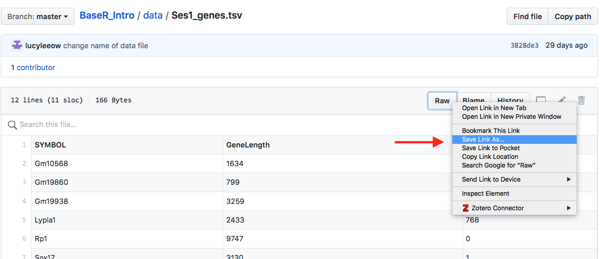

--- 
title: "Introduction to Base R"
author: "Lucy Liu"
date: "`r Sys.Date()`"
site: bookdown::bookdown_site
output: bookdown::gitbook
documentclass: book
bibliography: [ref.bib]
biblio-style: apalike
link-citations: yes
github-repo: lucyleeow/BaseR_Intro
description: "Introductory tutorial to base R, with a biological focus. In particular it will focus on analysing RNA-sequencing data with Bioconductor."
---

# Preface {-}

This introduction to base R course was designed for biologists with no previous programming experience. It has a focus on analysing RNA-sequencing data using the [Bioconductor](https://www.bioconductor.org/) package [limma](https://bioconductor.org/packages/release/bioc/html/limma.html). The F1000 paper ['RNA-seq analysis is easy as 1-2-3 with limma, Glimma and edgeR'](https://f1000research.com/articles/5-1408/v3) was used as a guide for the latter sessions.

It is intended to be delivered over four 2.5 hour workshops at the Walter and Eliza Hall Institute of Medical Research (WEHI).

## Data files

The data files require for this workshop are available on [Github](https://github.com/lucyleeow/BaseR_Intro/tree/master/data). To download a data file click on the file you wish to download then right click 'Raw' > 'Save Link As...':

**Acknowledgements**

* Thank you to [Shian Su](https://github.com/Shians), [Brendan Ansell](https://github.com/bansell) and [Professor Gordon Smyth](https://github.com/gksmyth) for your suggestions and review of this tutorial.
* This page was generated using the [bookdown](https://bookdown.org/) package by [YiHui Xie](https://yihui.name/). 

The source code for this page can be found on [Github](https://github.com/lucyleeow/BaseR_Intro).

